# Laser "Pointer" Instructions - (Boost, Visible Class 3B) variant

## Components
  - **Laser Host**: A shiny plated copper cylinder that can be twisted apart in the middle. The rear section is a thin walled tube, the front section is shaped to hold the Laser Diode tightly.
  - **Laser Lens Assembly**: The Lens is mounted on a thumbscrew and screws into the front section of the Laser Host, pinned by a spring inside.
  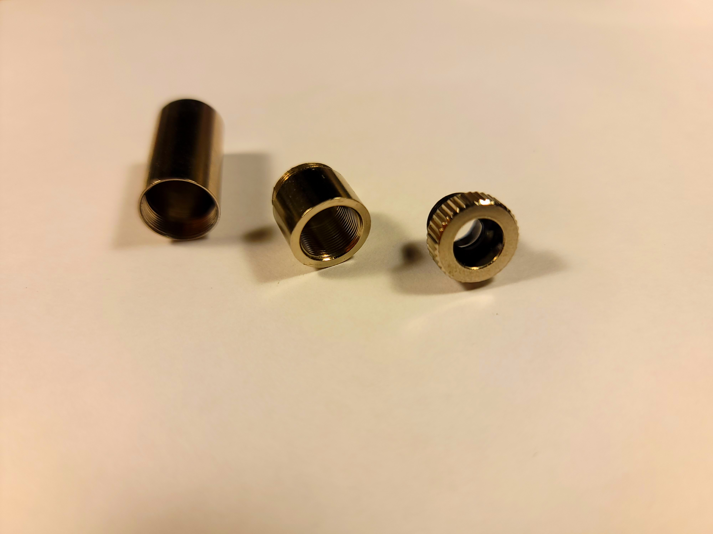
  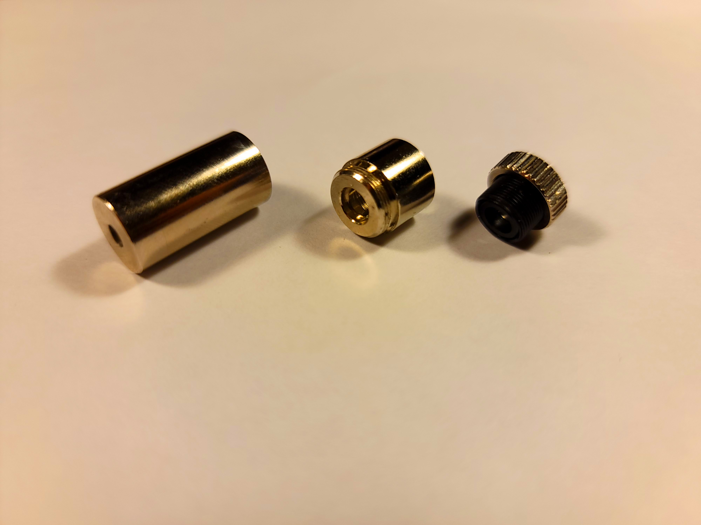
  - Copper Heatsinks: These will be soldered to the Laser Host's front section if the Laser Diode's thermal waste power demands it. Generally, Laser Diodes above 100mW optical output will require additional dissipation from these heatsinks.
  - **Laser Diode**: Nestled inside the Laser Host, two or three-pin gold plated component wrapped in yellow kapton tape for safety. **Do not open this protective tape yet**. The front has a sensitive optical window. 
  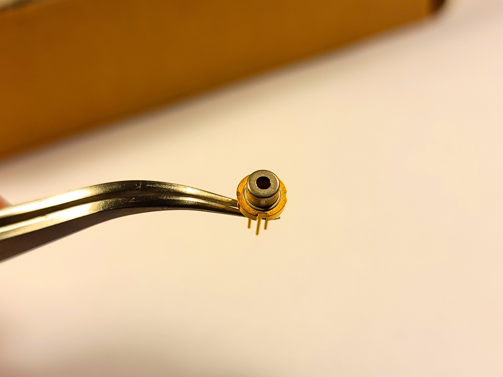
  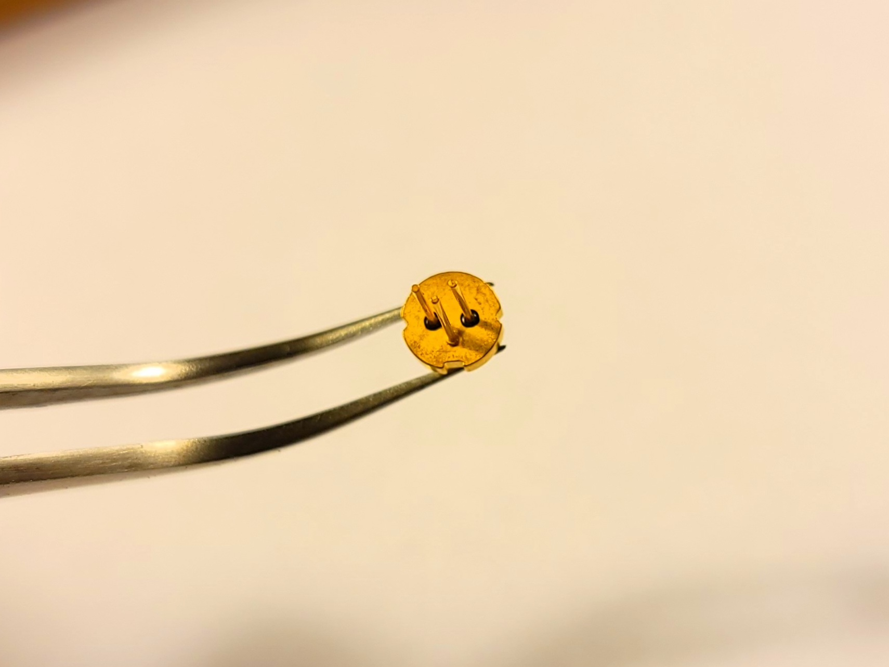
  - Base PCB: Color varies.
  - Charge and Protect Module: Small blue board with a USB connector.
  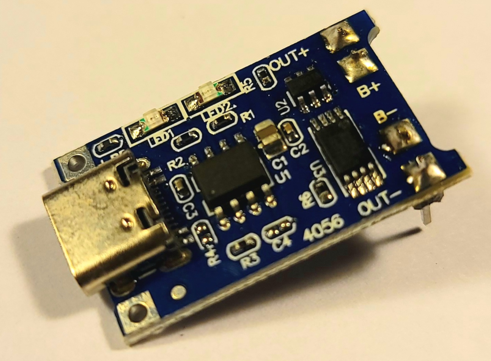
  - Battery Holder (18650 size): Large black piece with spring contact.
  - **Boost Converter Module**: Small blue board with a trimmer potentiometer.
  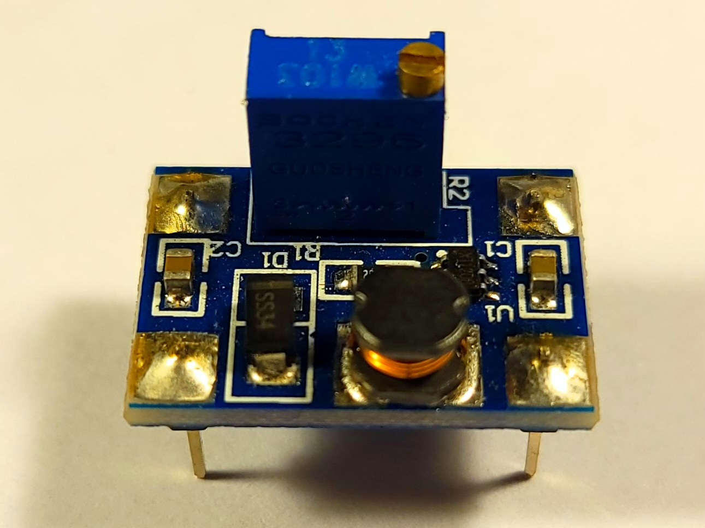
  - Bulk Capacitor: An electrolytic around 10uF, used for basic smoothing of the laser diode voltage.
  - Various Resistors: 1 10kO for capacitor drainage, and the rest for the current setpoint.
  - Button Switch: This component is not exactly protoboard-compatible, but it can handle the current necessary.
  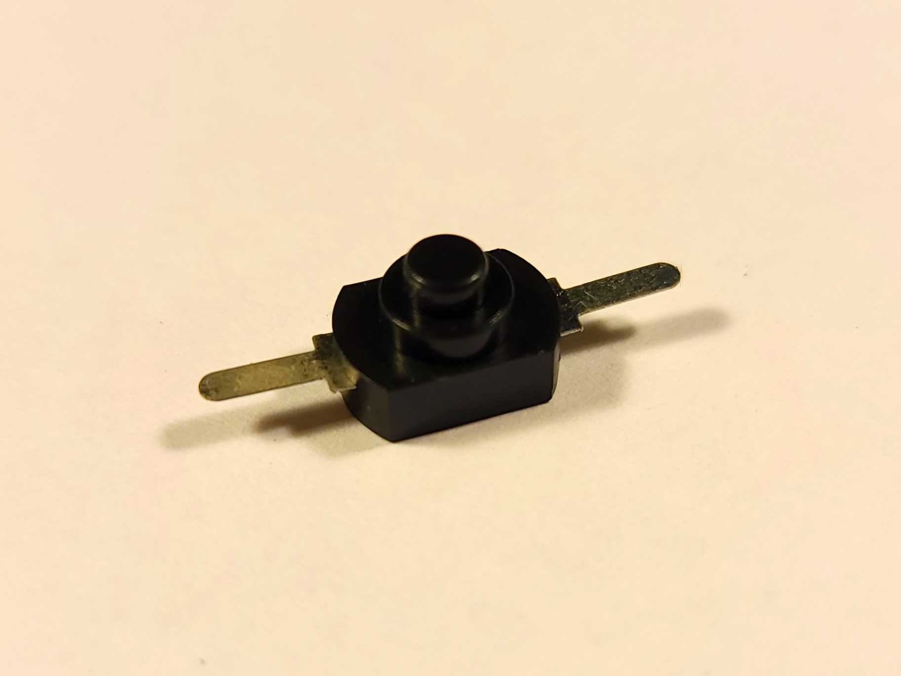
  - Male Header Pins: Up to 8 are needed, 4 for mounting each module.

Only the **bolded** components are essential, the rest can be substituted with what you have.

## Requisite Warnings
  - This is a laser, and depending on the exact parameters of the kit, potentially very powerful - up to 500mW for the Class 3B variant. You may have heard this many times before, yet it still bears repeating:
  
    **DO NOT POINT THE LASER AT ANYTHING YOU DO NOT WANT TO DESTROY**
    
    **DO NOT POINT THE LASER AT ANYTHING YOU DO NOT WANT TO DESTROY**

    **DO NOT POINT THE LASER AT ANYTHING YOU DO NOT WANT TO DESTROY**

    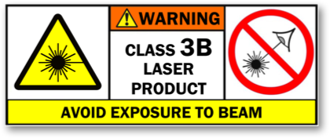
    
  - The Laser Diode in this kit may be *extremely* susceptible to stress, including static discharge, overcurrent, or overtemperature. Even nanosecond events can kill a diode, and once a laser diode goes dark, it cannot be restored. Keep it in the protective wrapping until the last possible moment, and once it is open, do not touch the optical window located on the silver side of the diode. 
  
    Additionally, to protect the diode electrically, it must be soldered to the boost converter output and the boost converter feedback must be connected properly as soon as possible. **Do not use removable connectors to power the laser diode**.

  - The kit assumes the usage of an 18650 size lithium ion cell. These energy sources always come with their own risks of fire and/or explosion when charging or discharging.
  
  - While other risks in the kit are minimal (there will be no high voltage or excessive heat), in the end there is no warranty whatsoever for what you do.
    
## Assembly

### Overall

#### Netlist

```
B+ Battery Positive 
B- Battery Negative
V+ Voltage Supply
GND Ground
LD+ Boost Output
LD- == FB Boost Feedback
```

#### Schematic

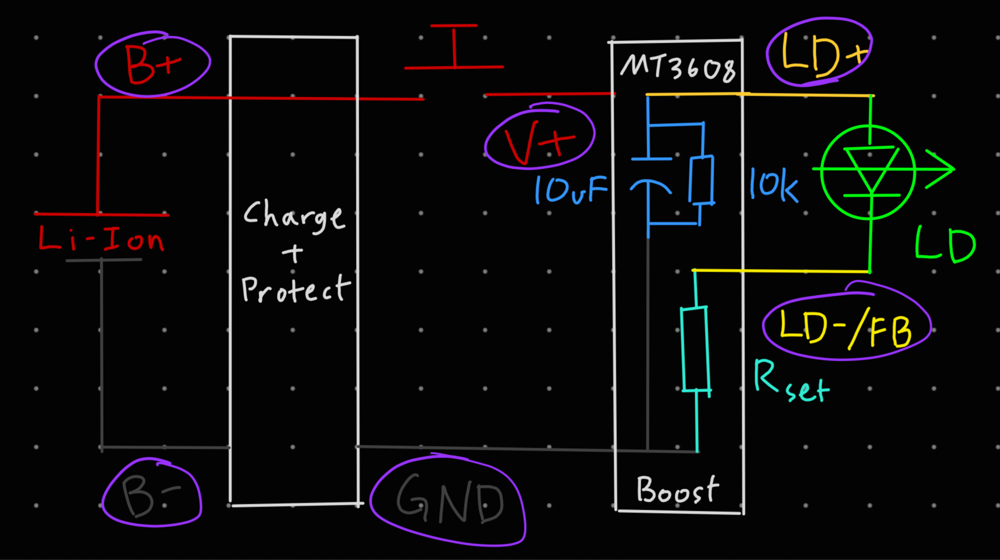

#### Boost Converter 

The Boost Converter Module features constant-voltage output by default, but a diode is a current controlled device. A setpoint resistor provides the transresistance necessary for the built-in feedback mechanism so a positive constant-current supply is generated.

  - Solder in 3 header pins. The output side `GND` connection is better to fit the resistor legs through, and it is redundant with the input side `GND` connection.
  - Remove the trimmer potentiometer. It is useless and will be replaced by a new feedback network. From this point on until otherwise specified, **do not power on the boost converter**. With an incomplete feedback network, it will boost its input voltage past its own maximum rating, destroying itself.
  
  - Desolder the small SMD resistor and solder in the correct setpoint resistors between `LD-/FB` and `GND`. `LD-/FB` is conveniently accessible as the middle pin of where the potentiometer used to be. The resistor values **MUST** be correct or the constant-current supply will not have the correct value.
  - Solder the electrolytic capacitor and drainage resistor directly between `LD+` and `GND`. Mind the polarity!

The prepared boost converter can be seen in this image:
  


#### Charge and Protect

This board protects the cell from electrical overstress and makes charging it easy through the onboard USB connector.
  
  - Solder in 4 header pins.
  - If the energy source of the laser is smaller in capacity than an 18650 cell, adjusting the onboard charge current set resistor may be necessary, consult a TP4056 datasheet for an appropriate value.

#### Button

Depending on the style of button switch used, it may need extra prep. This button switch is not protoboard-compatible, and requires bending of the legs and cutting them short.
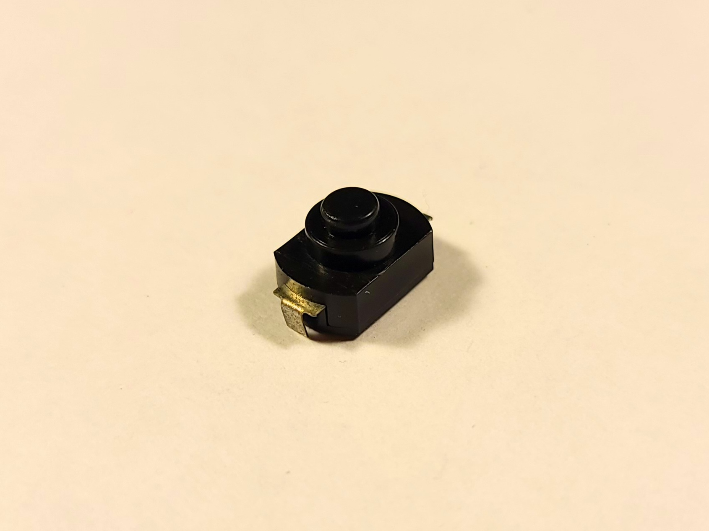

#### Heatsink

If your Laser Diode needs a heatsink, it will have to be soldered to the front section of the Laser Host before the Laser Diode is seated into it. 
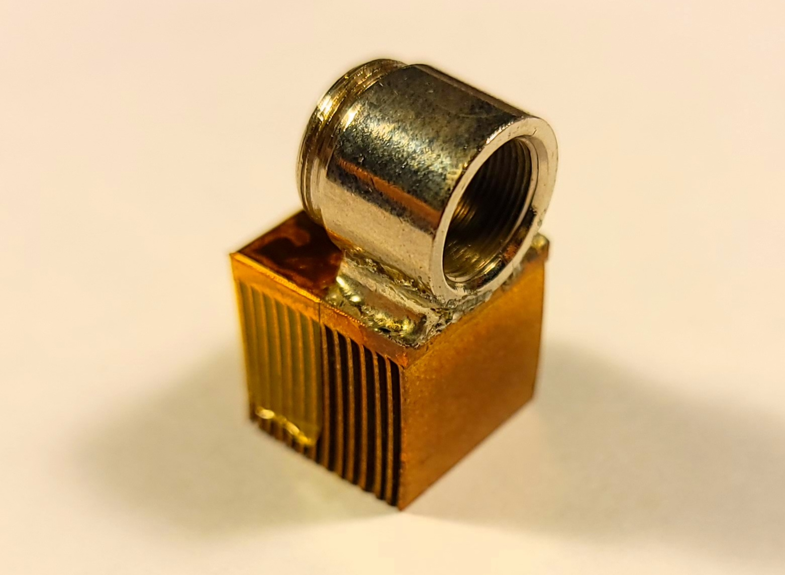
Soldering heatsinks is in general extremely tough since the express purpose of a heatsink is to dissipate heat, which the soldering process requires a concentration of. Some tips:
  
  - Wrap kapton tape around the whole heatsink, except for the surface to be soldered. Preventing the free movement of air will drastically reduce the heatsink's efficacy, which is good.
  - Tin the surfaces (both the heatsink and the Laset Host front section) throughly.
  - If necessary, use low-melting point solder (bismuth based formulations are especially easy to melt).

This process will only work for copper heatsinks. Aluminum and steel are extremely difficult to solder to - in that case, using an alternative thermal interface may be the only option. 

#### Laser Diode and Host

The heart of the laser, this small component generates the optical output.

  - Unwrap the Laser Diode from the kapton tape. Handle it carefully, being sure not to touch the output window.
  - Determine the polarity of the device. Using a severely current-limited power source like a power supply through a 10kO resistor or a button cell battery, connect it across two pins at a time and see when the laser diode emits a weak but visible light to determine which of the two or three pins are `LD+` and `LD-/FB`. Remember these.
  - Seat the diode into the Laser Host's front section, with the optical window pointing forwards. The Laser Host will have pre-applied thermal paste - don't touch it. 
  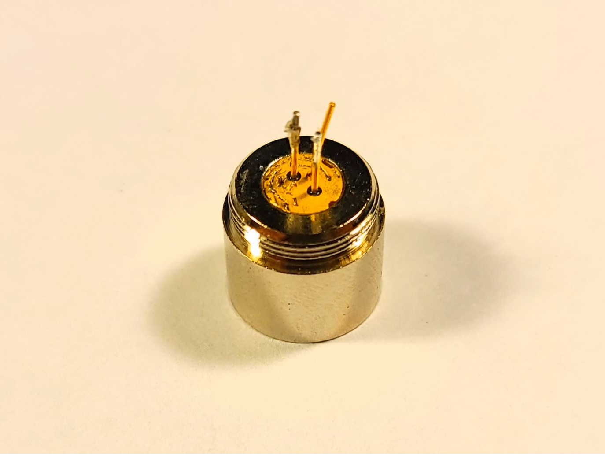
  This may require pliers or a hammer, but don't go too crazy. The gold-plated back of the laser diode should be flush with or sunk deeper than the surrounding Laser Host. If the Laser Diode is not sunk in far enough, the Lens may not screw in far enough to collimate its light into a beam.
  - Solder wire leads to the `LD+` and `LD-` pins. They should be long enough so that when the rear part of the Laser Host is reattached, the leads can still stick out of the hole in the rear part.
  - Temporarily solder the two wire leads together, this will electrically protect the Laser Diode.

#### PCB Assembly

You can follow the recommended board layout shown below or choose your own layout for everything but the Laser Host and Diode assembly.

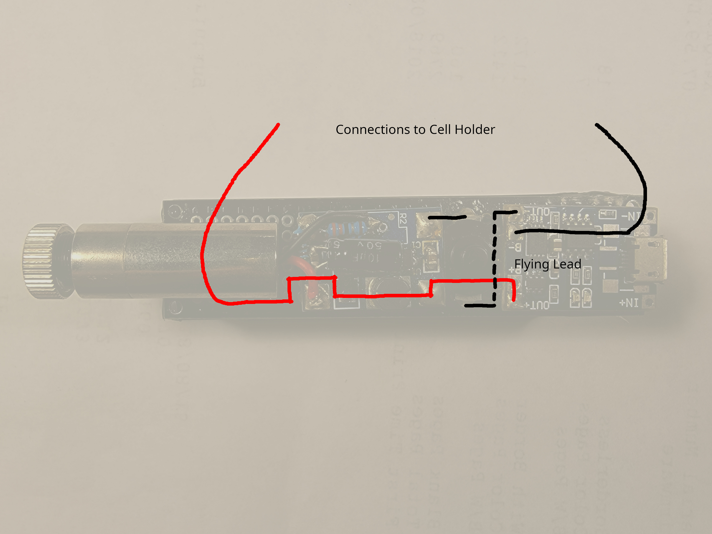

The Laser Host will have to be attached to the PCB, and hot melt glue is a good method to do so semi-permanently. After this is done, desolder the two leads from the Laser Diode from each other and connect them to `LD+` and `LD-/FB` on the Boost Converter, which can now safely be powered up.

#### Cell holder

Attach the cell holder to the underside of the board and connect its leads to `B+`, `B-`.

## Operation

The button switch controls main power to the whole circuit. 

On first install of the cell, the Charge and Protect module may refuse to output power. Plugging in a USB cable to the connector to start a charge impulse will kick the module into operation.1