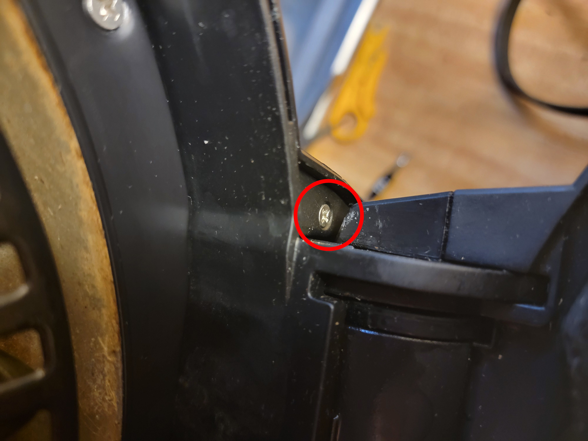

# Disassembling the Ninja Foodi Tendercrisp (FD300 and friends) Crisper Lid

One day my combination air fryer / pressure cooker decided to stop frying. The forced convection fan no longer span. This turned my combination air fryer / pressure cooker into a pressure cooker. I found this situation unacceptable. Therefore I decided to figure out what went wrong, and fix it. I did not find any preexisting guide on disassembling this part of the air fryer, so as well I documented the process here.

Fortunately the crisper lid is much less structurally precarious than the pressure lid - with my expertise mainly in the electronic side of consumer electronics, I would likely not dare to take apart and still trust a pressure cooker, and I do not recommend that anyone else who does not know what they are doing attempt it either.

## A Note on Repairing

Repair your broken items! There's a reason that reduce, reuse, and recycle are in the order that they are, and that is because you should not buy anything new if you do not need it. Additionally, this way you can save quite a bit of money, if that is good motivation. If you don't have the skills necessary to repair your item, you can either give it to someone who does, or learn that skill yourself! Only if neither of those are possible should you relegate your item to reuse (as something else), or failing that, recycling.

## Disassembly

**Ensure the fryer is unplugged!**

Fair warning - this procedure causes permanent structural damage to the air fryer. It is just a couple of ripped screw posts, and I don't notice any difference after putting it back together, but damage is damage.

### Top Fascia

- Pry off the top shiny detail cover piece. It is attached with 3 weak clips and should separate easily.

- Unscrew 2 Phillips screws, 1 on each side, that join the top fascia to the lid base.

- Unscrew 4 Phillips screws, 2 on each side, on the underside of the lid that join the top fascia to the lid base.

- Unscrew 2 Phillips screws, 1 on each side, on the underside of the lid that join 2 small side fascia to the top fascia. Remove the 2 side fascia.

- Pry the top fascia off, starting opposite the hinge. There are actually 2 more screws that hold the top fascia on near the hinge, but those are impossible to reach without first disassembling the entire hinge. So just skip it. A single strong clip holds the top fascia on here, so a lot of force will be required to overcome it.

- Once the clip has disengaged, continue pulling the top fascia off. The goal here will be to snap the remaining screw posts clean off. When that is done, the top fascia will be free - remove it.

- Remove the 2 heat-resistant duct pieces.

- The motor should now be visible, but leave it for now, since its shaft is still connected to the fans.

### Heater Assembly

**Ensure that the fryer has not been used recently, and the coil is cold.**

- Unscrew 4 Phillips and 4 Torx Security 15 screws that join the coil guard to the lid base. Remove the coil guard.

- Unscrew 1 Phillips screw that joins the coil assembly to the heat shield. Gently pull the coil assembly out of the way, noting how the cross-spar is held in place by holes along the heat shield.

- Undo the counter-threaded (so clockwise to loosen!) nut that holds the impeller fan, washer, and lock on the motor shaft. Remove all 3 components.

- Unscrew 2 Phillips screws, 1 on each side, that join the heat shield to the lid base. Gently pull the heat shield out of the way, it is still held by wires.

- There are 3 safety components that are held against the heat shield - the grounding connection, the thermal fuse, and the thermostat. All 3 are held by nuts on the blind side of the heat shield and so are somewhat simple to disassemble (although you will have to catch the nut when it falls out) but very difficult to reassembly. Look forward to the Reassembly section to see if your heart is steeled for this. If so, unscrew all 3 screws, carefully noting the additional washers and locks on each.

- Pull the heat shield away to reveal the bushing, washer, and finally dispeller fan on the motor shaft. Remove all 3 of these.

- The motor can now be freed, unscrew 3 Phillips screws and remove the 3 washers.

- Cut the motor leads and remove the motor itself.

## Motor Diagnostics

- The motor used in this air fryer is a simple single-phase AC induction motor, so there are very few parts that can break. Therefore, the diagnostic procedure is simple.

### Test the Power Supply
- Return to the cut motor leads on the fryer. Connect them to a load that can accept **mains voltage**, like an incandescent lightbulb. Then, replace the pot in the fryer, **carefully plug in the fryer**, select a cooking course, and start it. **Quickly press the power button to cancel and de-energize the heater**, since in just 5 seconds it can heat up enough to burn skin. The load should have immediately turned on, proceed to the next step if so. If it did not, your problem is not with the motor, but its power supply. This was not the diagnostic path I took, so you are on your own from here, but I would suggest disassembling the hinge assembly and control panel assembly somehow, as one of those places is bound to be where the power supply relay is located.

### Test Motor Continuity
- Apply an ohmmeter directly across the motor leads. If it reads open, proceed to the next step. If it reads approximately `23Ω`, your problem is not with the windings. Unfortunately this was not the diagnostic path I took, so you are on your own. At this point, motor replacement is highly suggested, as something may be wrong with the electric steel, bearings, or pole shaders, and repairing any of those is not usually within a hobbyist skillset, but don't let me tell you what you can't do!
- Cut open the insulation tape to reveal the connections where the motor leads are soldered to the winding. You may have to also carefully cut into the heatshrink to access the solder joints directly.

Apply an ohmmeter across the remainder of both motor leads and then also the winding directly. If the winding reads open, your motor is totaled, and motor replacement is required. Otherwise, as in my diagnostic path, you can simply bypass the broken segment of the motor lead and re-solder to the winding itself to restore continuity across the leads.

- Restore the insulation tape with high-temperature-resistant polyimide tape for safety. You can then test the motor afterwards by applying **mains voltage** to it and check that it spins.

## Reassembly

This will mostly follow the reverse of disassembly (replace : remove, screw : unscrew, clip : unclip, solder : cut), except for the 3 safety components on the heat shield. Since the nuts that hold them in are on the blind side of the heat shield, fitting them on will be challenging. My sincere recommendation is to simply cut the ground connection and attach that one first, then solder it closed later, as it is the wire with the least slack. Doing so, reaching around for the other 2 safety components and fiddling around with the screw to find the nut should not be too bad.

These diagrams display what has to be threaded through what, for:
- The ground connection - screw through washer, lock, heat shield, ground terminal, and finally nut.

- The thermal fuse - screw through heat shield, bracket that holds both leads of the thermal fuse, lock, and finally nut.

- The thermostat - the thermostat itself must protrude through the other hole in the heat shield. Then the screw threads through the heat shield, thermostat bracket, lock, and finally nut.
