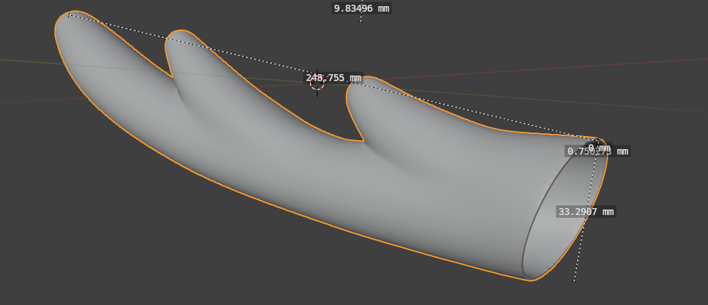

# Nokotan's Antlers
shikanokonokonokokoshitantan

shikanokonokonokokoshitantan

shikanokonokonokokoshitantan

shikanokonokonokokoshitantan

nun!

## ...?

Here at LowTierTech it is time for another wearable electronics project! This time, the enigmatic cracker-loving deer-human hybrid Shikanoko Noko serves as inspiration. Just look at those magnificent antlers!

## Design

I'm not a very talented 3d modeler, so I borrowed the [hard work](https://cults3d.com/en/3d-model/fashion/noko-shikanoko-antlers-for-cosplay-modelvault) of Modelvault (who apparently is one) over on Cults3d. It was easily resized to `27cm` in length, which I thought would fit me well.

But I had a couple more requirements for the model - this is LowTierTech, not LowTierCosplay (no matter how much I wish it were so...). Those requirements were:

- The antlers must sit at the right angle on whatever they are mounted to (probably a headband and not my cranium).
- The antlers must be detachable from whatever their mount.
- The antlers must light up on command.

These necessitated some truly bumbling Blender work which my lack of experience in 3d CAD can account for, but after a few hours of searching through the internet and searching through Blender's UI, I was able to hollow out the model to have `1mm` or so thick walls, remove the root, and adjust the angle of the root of each antler to around `30` degrees instead of the `7` they came as.

##

## Installing the "Sensor"

Nokotan's antlers have the curious ability to sense all sorts of aspects of the true nature of a person, and they glow a blinking red when they do so. Naturally, these antlers must do the same. 
