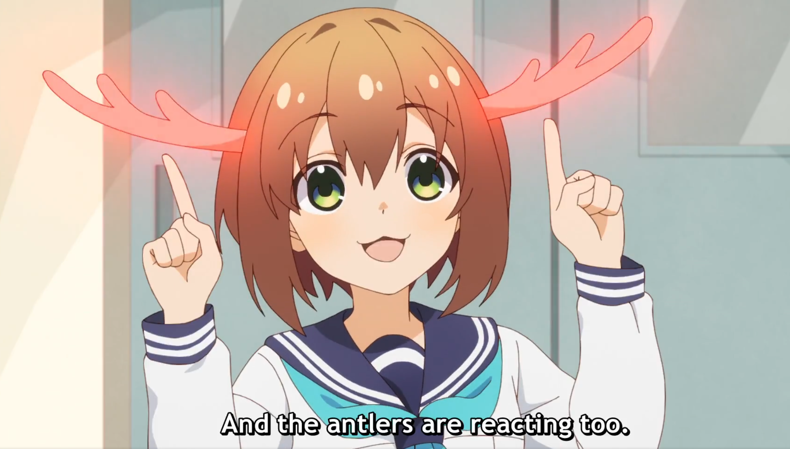
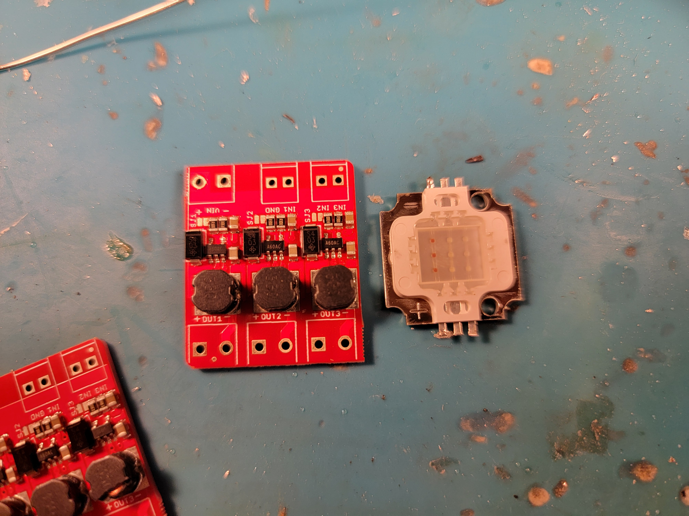
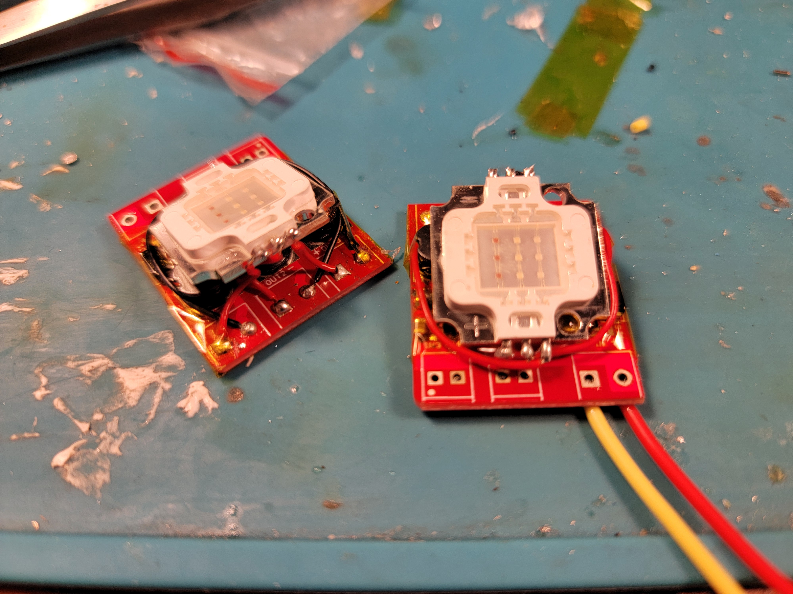
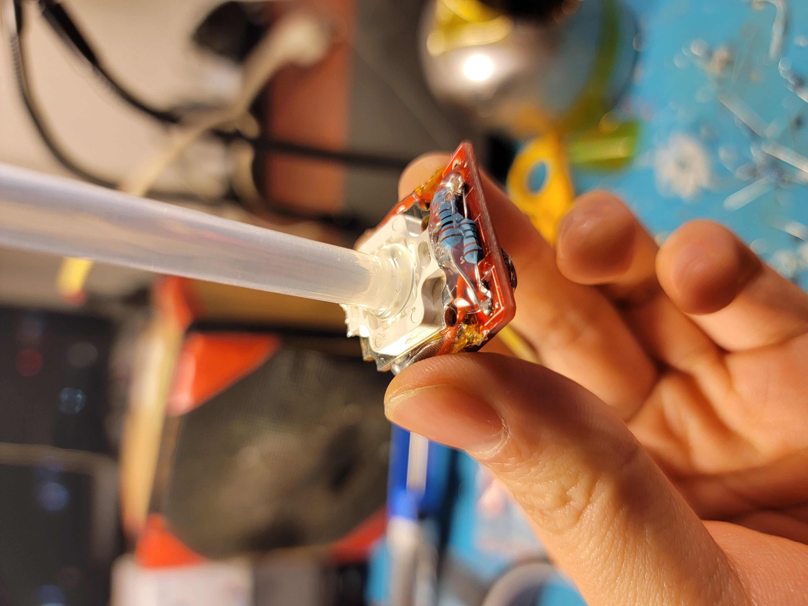
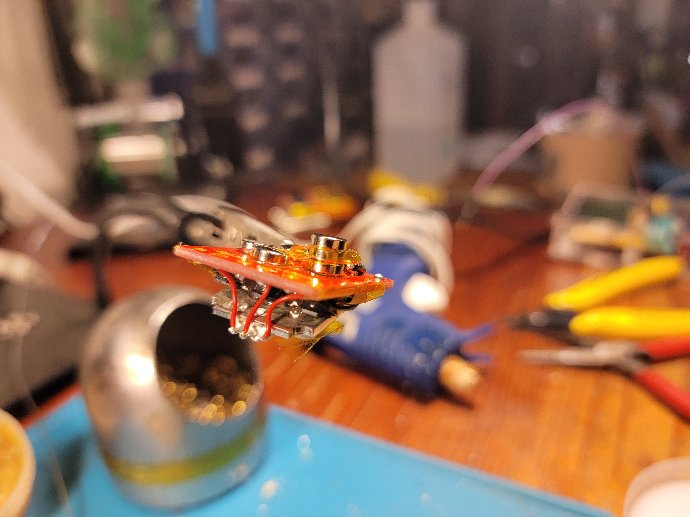
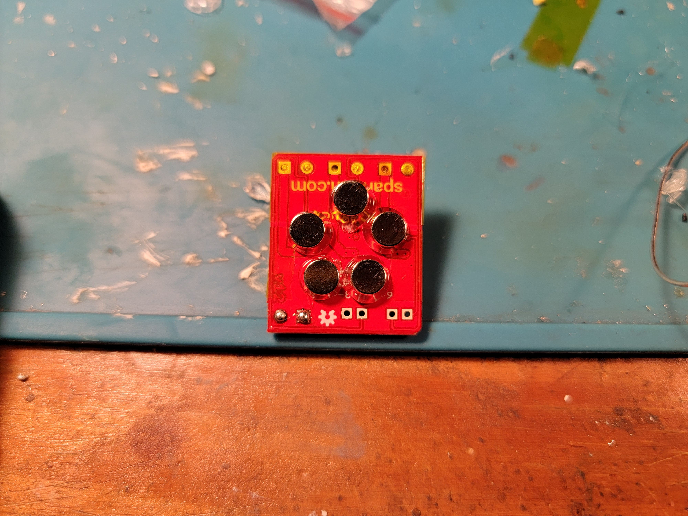
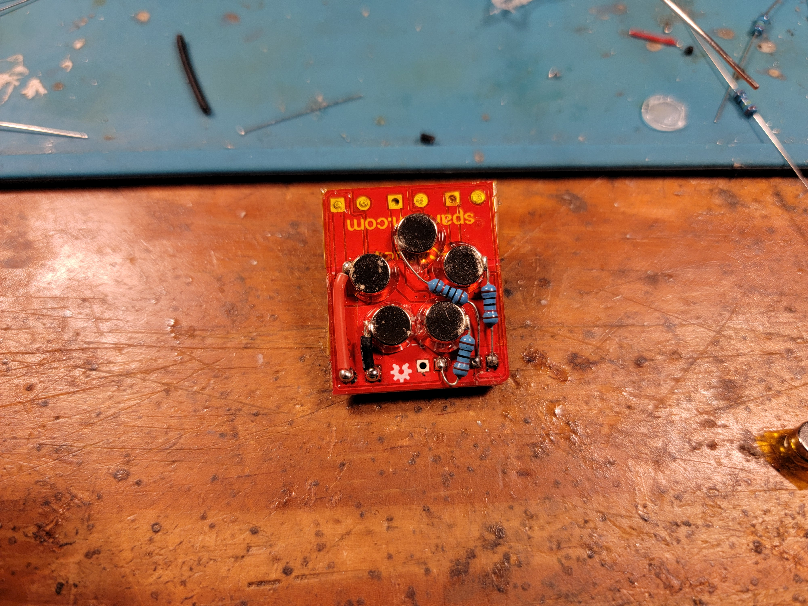
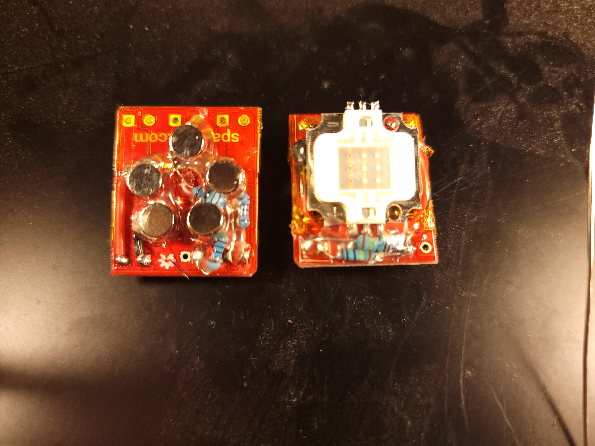
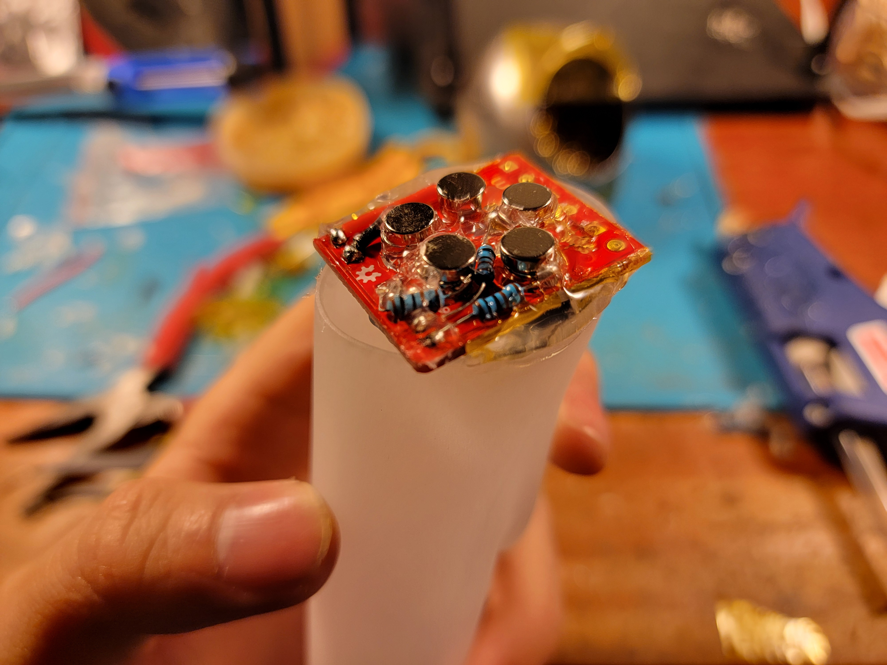

# Nokotan's Antlers
*shikanokonokonokokoshitantan*

*shikanokonokonokokoshitantan*

*shikanokonokonokokoshitantan*

*shikanokonokonokokoshitantan*

**_nun!_**

## ...?

Here at LowTierTech it is time for another wearable electronics project! This time, the enigmatic cracker-loving deer-human hybrid Shikanoko Noko serves as inspiration. Just look at those magnificent antlers!

## Design

### Structure and 3D Modeling

I'm not a very talented 3d modeler, so I borrowed the [hard work](https://cults3d.com/en/3d-model/fashion/noko-shikanoko-antlers-for-cosplay-modelvault) of Modelvault (who apparently is one) over on Cults3d. It was easily resized to `27cm` in length, which I thought would fit me well.

But I had a couple more requirements for the model - this is LowTierTech, not LowTierCosplay (no matter how much I wish it were so...). Those requirements were:

- The antlers must sit at the right angle on whatever they are mounted to (probably a headband and not my cranium).
- The antlers must be detachable from their mount.
- The antlers must light up on command. Therefore they must be hollow, and also have electrical power transmitted to them.

These necessitated some truly bumbling Blender work which my lack of experience in 3D CAD can account for, but after a few hours of searching through the internet and Blender's UI, I was able to hollow out the model to have `1mm` or so thick walls, remove the solid base, and adjust the angle of the base of each antler to around `30` degrees instead of the `7` they came as.

And in solid cured resin form, the printed antlers come out nicely translucent - although with such thin walls, some warping at the base was to be expected. No matter, a few seconds over a stove burner softened them up enough to restore the correct shape.

### Installing "Sensors"

Nokotan's antlers have the curious ability to sense the true nature of a person, and they glow a blinking red when they do so. Naturally, these antlers must do the same. Distributing a even red glow across the entire interior of the antler proved to be a nontrivial task, however.

I chose some beefy [RGB LEDs](https://www.amazon.com/Chanzon-Power-Common-Anode-300mA/dp/B01DBZK64K) to light this model up for three reasons:
- I had 2 on hand unused from years ago - this should always be the primary reason for a scrappy tinkerer who uses every part to its fullest potential like me.
- LDs, especially red ones, would have imparted a more pure ruby-red glow (`650nm` compared to the orange-ish `638nm` of common high power red LEDs). However, the intolerance of older red LDs to power supply noise would be difficult to negotiate with - the antlers are removable, so power can disappear at any time! Besides, I think the ability for these antlers to take on any color is an upgrade!
- LDs are also sensitive to heat, and efficient as they may be, it would be difficult to adequately cool such tiny heat-producing parts in a space with absolutely no airflow, whereas the LED COBs come on a thick copper plate that comfortably soaks up the intermittent heat of the "sensor" function. However, due to average heat concerns, the each LED COB must still be limited to outputting around 0.5W of light on average over a long period.

Driving these specific LEDs is easy enough - simply pass in at least `11V`, enough for the 3 blue LED chips in series, to a ["Picobuck" 3-channel current supply buck converter](https://www.sparkfun.com/products/13705) and supply 3 TTL PWM (or analog, but we are going digital here) control inputs. I also had 2 of these on hand from many years ago, and they comfortably fit within the base of each antler. If you are following along at home, then of course any current buck (so any buck at all with a current sense resistor) powerful enough to light up your LEDs of choice will suffice, no need to pay `$17.50` twice for these if you don't want to.

I ended up gluing the LED COB angled onto to the buck converter itself to create a compact unit - remember to insulate with polyimide tape!

Without any control inputs, these are default full-power at `300mA` or so per channel and light up each antler a brilliant white, although the glow is not even close to uniform. Therefore, some lightguiding is needed. I went full jank and used 2 hot melt glue sticks stuck in a line - they actually work quite well, though much worse than I imagine proper glass fibres would. If you are also using hot melt glue sticks, work on attaching the magnets first (see the section on [Designing Mounts](#designing-mounts)! Otherwise the glue may work itself loose while soldering work is performed.

Additionally, pulling the control inputs down with `10k` resistors is also a good idea, in case by pure chance the power connections are made before control connections.

### Designing Mounts

With detachability a requirement, the obvious choice is magnet mounting - and neodymium magnets in particular can somewhat easily be soldered to, allowing them to transmit power and signals as well.

A side note - soldering to magnets can be annoying. First, most soldering iron tips will be attracted by magnets, so that is bad enough. But also, for magnetic connectors, it is important to have as little solder lumping up on the mating surfaces as possible, so that magnets can sit flat against each other. And finally, heating magnets as little as possible is generally a good idea to keep them strong. A good way to make all of these easier is to attach another magnet on top of the mating surface, shielded by polyimide tape so that solder does not stick to it (and solder the magnets together). This picture shows a stack of 3, the middle one operating as a shield.

We need 5 lines, `V+`, `GND`, `TTL_R`, `TTL_G`, `TTL_B`. The magnet arrangement must also be keyed, with reverse polarity (and other horrific misconnections) impossible. A good arrangement to achieve this is to have `~1k` resistors protecting the control inputs, and `V+`, `GND` on adjacent to each other, all 5 magnet connections in a rough pentagon. **Make sure that some magnets have the opposite polarity as the others**, that way the antler will be repulsed from the mount if it is rotated instead of attracted:

After wiring up the magnets, the magnets themselves may be weakened due to the heat. Sticking another magnet onto each is a good way to restore strength - use a glue to secure these.

This magnetic arrangement makes it completely impossible to misconnect anything - rotating the connector any arbitrary angle connects the incoming power lines to either protected control lines (so a harmless amount of current flows) or nothing at all. The other 3 incoming lines are signals, and those have limited output (from protection resistors on the mount side) and are therefore also protected from high current. And finally, rotating this arrangement at all causes powerful repulsive forces resisting any connection at all in the first place.

This completes the work on the "sensors" - finally, restore your light-piping solution and secure the "sensors" inside the antlers.

### Installing Sensors

Actual sensors, this time.

Ideally, an overtly manual action like a button press would not be required to trigger the antlers' glow, since that is meant to be an innate ability of Shikanoko's antlers. Being able to be triggered by subtle movements limits wearable options severely, though, to those like accelerometers, myographs, and more exotic options like brainwave scanners.

### The Headband

Home Base: The headband will hold the power supply and the smarts. Guesstimating total power consumption, each antler will be `12V 200mA` and the headband circuitry `3V 50mA`, thus a 1S 18650 cell is plenty.

For the microcontroller, I used my beloved `ATTINY85` since only 3 control lines and 2 sensor lines were necessary, and `8KiB` is plenty of storage for even hundreds of lighting patterns.

## Assembly

