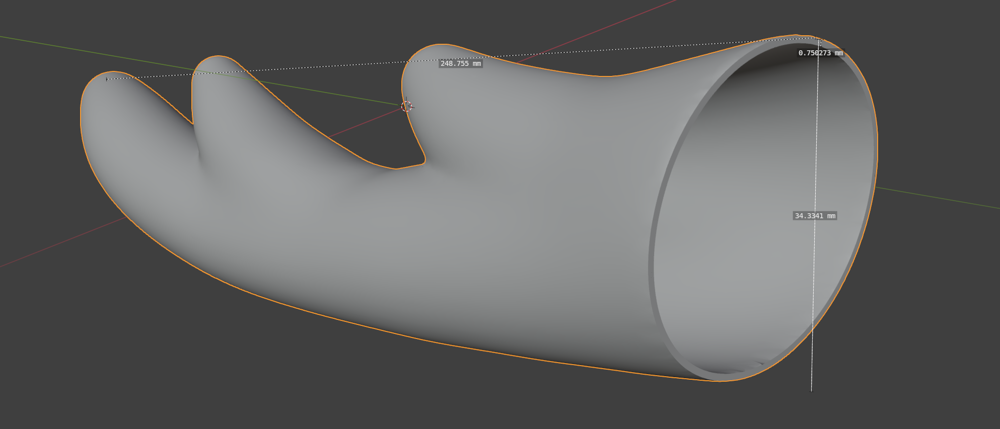

# Nokotan's Antlers
*shikanokonokonokokoshitantan*

*shikanokonokonokokoshitantan*

*shikanokonokonokokoshitantan*

*shikanokonokonokokoshitantan*

**_nun!_**

## ...?

Here at LowTierTech it is time for another wearable electronics project! This time, the enigmatic cracker-loving deer-human hybrid Shikanoko Noko serves as inspiration. Just look at those magnificent antlers!

## Design

### Structure and 3D Modeling

I'm not a very talented 3d modeler, so I borrowed the [hard work](https://cults3d.com/en/3d-model/fashion/noko-shikanoko-antlers-for-cosplay-modelvault) of Modelvault (who apparently is one) over on Cults3d. It was easily resized to `27cm` in length, which I thought would fit me well.

But I had a couple more requirements for the model - this is LowTierTech, not LowTierCosplay (no matter how much I wish it were so...). Those requirements were:

- The antlers must sit at the right angle on whatever they are mounted to (probably a headband and not my cranium).
- The antlers must be detachable from their mount.
- The antlers must light up on command. Therefore they must be hollow, and also have electrical power transmitted to them.

These necessitated some truly bumbling Blender work which my lack of experience in 3D CAD can account for, but after a few hours of searching through the internet and Blender's UI, I was able to hollow out the model to have `1mm` or so thick walls, remove the solid base, and adjust the angle of the base of each antler to around `30` degrees instead of the `7` they came as.

And in solid cured resin form, the printed antlers come out nicely translucent - although with such thin walls, some warping at the base was to be expected. No matter, a few seconds over a stove burner softened them up enough to restore the correct shape.

### Installing "Sensors"

Nokotan's antlers have the curious ability to sense the true nature of a person, and they glow a blinking red when they do so. Naturally, these antlers must do the same. Distributing a even red glow across the entire interior of the antler proved to be a nontrivial task, however.

I chose some beefy [RGB LEDs](https://www.amazon.com/Chanzon-Power-Common-Anode-300mA/dp/B01DBZK64K) to light this model up for three reasons:
- I had 2 on hand unused from years ago - this should always be the primary reason for a scrappy tinkerer who uses every part to its fullest potential like me.
- LDs, especially red ones, would have imparted a more pure ruby-red glow (`650nm` compared to the orange-ish `638nm` of common high power red LEDs). However, the intolerance of older red LDs to power supply noise would be difficult to negotiate with - the antlers are removable, so power can disappear at any time! Besides, I think the ability for these antlers to take on any color is an upgrade!
- LDs are also sensitive to heat, and efficient as they may be, it would be difficult to adequately cool such tiny heat-producing parts in a space with absolutely no airflow, whereas the LED COBs come on a thick copper plate that comfortably soaks up the intermittent heat of the "sensor" function. However, due to average heat concerns, the each LED COB must still be limited to outputting around 0.5W of light on average over a long period.

Driving these specific LEDs is easy enough - simply pass in at least `11V`, enough for the 3 blue LED chips in series, to a ["Picobuck" 3-channel current supply buck converter](https://www.sparkfun.com/products/13705) and supply 3 TTL PWM (or analog, but we are going digital here) control inputs. I also had 2 of these on hand from many years ago, and they comfortably fit within the base of each antler. If you are following along at home, then of course any current buck (so any buck at all with a current sense resistor) powerful enough to light up your LEDs of choice will suffice, no need to pay `$17.50` twice for these if you don't want to.

I ended up gluing the LED COB angled onto to the buck converter itself to create a compact unit - remember to insulate with polyimide tape!

Without any control inputs, these are default full-power at `300mA` or so per channel and light up each antler a brilliant white, although the glow is not even close to uniform. Pulling these control inputs down with `10k` resistors is also a good idea, in case by pure chance the power connections are made before control connections.

Additionally, some lightguiding is needed to smooth out the glow. I went full jank and used 2 hot melt glue sticks stuck in a line - they actually work quite well, though much worse than I imagine proper glass fibres would.

### A Detachable Connection

With detachability a requirement, the obvious choice is magnet mounting - and neodymium magnets in particular can somewhat easily be soldered to, allowing them to transmit power and signals as well. **However, after a first pass using magnets as contacts, I realized that more than 3 magnets make for TERRIBLE contacts**, since they are usually rigid and so a slight deviation from perfect planarity (3 points determine a plane) of a magnet constellation will result in non-connection. Instead, **use magnets for positioning and clutch force, which is what they excel in, and use spring contacts for the actual power and signals**. Each of these, formed from a waste resistor leg, can bend many many times without breaking and are decently elastic. They can easily interface with copper tape pads on the opposing PCB, although initially positioning them is a little tedious and touching them afterwards can knock them out of alignment, necessitating a quick repair. Of course, more robust commercial spring contact solutions exist, but they aren't free.

We need 5 lines, `V+`, `GND`, `TTL_R`, `TTL_G`, `TTL_B`, so 5 springs for each antler suffice.

The magnet constellation to hold the antler to the mount must also be keyed, with reverse polarity (and other horrific misconnections) impossible. A good arrangement is to have the magnets in a rectangle, 2 on one side and 2 on the other side with opposing polarity so that if flipped, the antler will be repulsed from the mount instead of attracted if it is rotated:

You can make both antlers identical (even in polarity) to keep them interchangeable, but then matching the magnet pattern exactly is tough. I recommend adding more magnets to key left vs. right too, making sure that the left antler, even if rotated properly, is repulsed by the right mount.

Adding even more magnets can be a good idea, depending on how powerful yours are. Aim for each mount to be able to hold up the entire antler set when you grab it only by an antler, but this isn't strictly necessary. Don't add too many though, or you won't be able to remove the antler from your head easily when the time comes.

If you desire even more clutch power, then you can always cheat with some tacky adhesive on the magnet surfaces directly, of course.

It is important to "print" the magnet constellation of each antler accurately onto the mount plate. To do this, stick magnets onto each magnet of the antler so there are now 2 magnets with 1 free, apply adhesive to the top free magnet, then press the whole thing onto the mount plate.

Afterwards, install 5 corresponding pads for the spring contacts to engage and wire them up. I recommend adding 3 `~1k` resistors protect the control inputs from accidental misconnections to power pins, since who knows what can happen?

This completes the work on the "sensors" and mounts, all that is left is to secure them inside the antlers.

### The Headband: Home Base

The headband will hold the power supply and the smarts. Guesstimating total power consumption, each antler will need `12V 200mA` for just the red portion, and the headband circuitry `3V 50mA`, thus a 1S 18650 cell and a cheap boost converter is plenty, or a smaller flat cell too. However, already going through the effort of including a removable connector, I decided to design a more robust power pack backed by 2S 18650s and a slightly more capable boost converter to output approximately `11.5V` that would be able to portably power other gadgets in the future too. Add a velcro band, and this can easily be secured to a limb.

It kind of looks like an improvised explosive device though, and I'm not sure strapping it to my body will help much in that regard. Oh well, just don't take this into airports.

For the microcontroller, I used my beloved `ATTINY85` since only 3 control lines and up to 2 sensor lines were necessary, and `8KiB` is plenty of storage for even hundreds of lighting patterns. For the program loaded onto the microcontroller, see [notsu-antlers](https://github.com/MrCocoNuat/notsu-antlers), and modify it however you like (according to its license!) to add your own lighting patterns and sensor logic.

**These images of the smarts board contain a wiring mistake: `V+`, the red wire, should supply from the `11.5V` input, Not the `5V` regulated output! Follow the pink-line edits!**

The circuit to support the smarts is extremely simple, an `LM317` supplies about `5V` to the microcontroller (look ma, no capacitors!), and otherwise there is only wiring.

### Installing Mounts and Antlers

I decided to (pretty much) permanently attach the 2 mount plates to the headband. Check your placements in a mirror, the worst thing is to have lopsided antlers!

Wiring these parts up can be difficult, since the magnets restrict available space around the all-important contacts, and the contacts themselves also present mechanical exclusion zones. The exact wiring arrangement will depend on your specific physical design, but no matter, you can do it!

### Installing Sensors

Actual sensors, this time.

Ideally, an overtly manual action like a button press on a remote would not be required to trigger the antlers' glow, since that is meant to be an innate ability of Shikanoko's antlers. Being able to be triggered by subtle movements limits wearable options severely, though, to those like accelerometers, myographs, and more exotic options like brainwave scanners. But most of those don't abide by the LowTierTech manifesto at all!

Instead, I settled on the simplest option - a hidden switch. I have the ability to voluntarily flex my posterior auricular muscles ("wiggle my ears"), so a cleverly hidden hair trigger switch on the headband behind my ear can easily trigger the glowing action. The positioning is a little finicky, but so would it be for any of those other high-tech options. Of course, interfacing with this is extremely easy as well, and is handled in code.

## Assembly

Glue everything together with your adhesive of choice, and...

Go, brilliant deer, and celebrate with some well deserved deer crackers!

