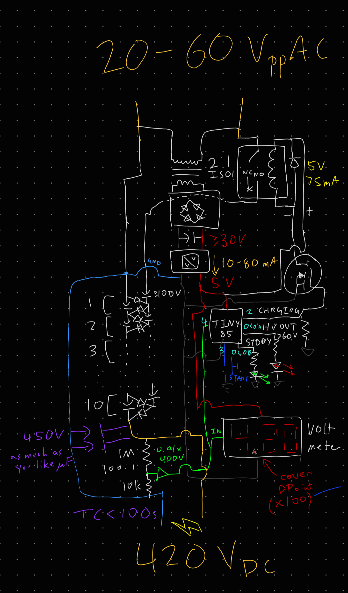

# Nice Cockcroft-Walton

Ok, jokes aside - the [Cockcroft-Walton Multiplier](https://en.wikipedia.org/wiki/Cockcroft%E2%80%93Walton_generator) is a design that generates DC from AC, charging up `N` stages of capacitors sequentially while keeping them in series so that the final output voltage achieved is as high as `N*Vpp`. To understand this, think of those old toys where figurines would slide down a track until they hit a staircase, and like magic, a constantly oscillating motion could move them all the way to the top for them to slide down again.

In this circuit, the input AC is the oscillating motion and electron front is the penguins - as each capacitor is charged by one half-wave (`C1` first), the next half-wave pushes the particular stack ending with that capacitor to a high enough voltage to exceed that of the other stack, and so the next capacitor in sequence can charge (here, `C2`). After many iterations (remember that `C1` will lose voltage charging `C2`, so the overall process isn't quite that fast), each of the capacitors in the output stack (`C2`, `C4`) holds `Vpp`, and the output is generated!

With a output frequency around 20kHz, the ZVS driver is almost ideally suited for supplying this generator. You can send power through a HV transformer first, so that `Vpp = 10-20kV` and use corresponding high voltage diodes and capacitors, or pipe the `60Vpp` directly into a low voltage but higher power version of the circuit. That is what I did.

(don't worry, every part is explained thoroughly)

## Risks

Sure, this is LowTierTech, but that doesn't mean it has to be LethalTierTech~

In rough order of danger, the risks I wanted to control against were:
- Explosion of the main power capacitors, charged at 450V they can do a lot of damage!
- Exposure of up to 400V on the output terminals
- Wire overcurrent leading to fire

In turn:
- I wanted a hard-switch to disconnect the capacitor chain, and this really had to be hard. Considering the required specs (`60VAC`, able to *break* `10A`) a mains-class relay was the obvious choice. But this necessitates the integration of control electronics!
- I used a 3-port shrouded screw terminal, but with the middle post and screw completely removed. This provides sufficient isolation both between the output terminals and to the outside world. Additionally, during testing and use, make sure to have a rapid discharge resistor handy. It must be capable of dumping all the output energy into heat, so I suggest a `5kO` or so power resistor, which should be just fine absorbing a `400V` capacitor.
- ...realistically this is not likely to happen. Just don't be stupid, use at least 18AWG or something to handle `10A` bursts.

## Control Electronics

With the introduction of a relay on the input side, I needed a microcontroller to control it. Of course, I picked my beloved `ATtiny85` for the job. It however demanded payment of `5VDC`, which I certainly could not get directly from the input AC. No matter - I put a basic **isolated** converter consisting of a transformer, rectifier, and buck converter between them, this makes it possible to define my digital `GND` anywhere on the capacitor chain and measure voltages between any 2 points, which is necessary to sense the actual output voltage.

The actual voltage sensing is done through a `1:100` resistor divider (which also acts as a bleed resistor for the main capacitors) to limit the range to `0-4VDC`, then through a buffer to provide minimal output impedance before being delivered both to the microcontroller and a [miniature display voltmeter](assets/voltmeter.png) with the decimal point blacked out to increase the displayed number by 100 times - these are nifty little gadgets!

As for I/O, the microcontroller gets 1 input button on pin 2 external interrupt (remember to add a debouncing capacitor, I initially forgot), and a output to the relay's coil through a FET. Remember the flyback diode for the coil! Finally, 2 status LEDs give the user an idea of how the overall converter is doing.

A bonus feature is an adjustable output voltage, which I achieved with a trimmer potentiometer attached to the microcontroller's `RESET` pin.

## Power Electronics

The main limiting design parameter to this whole project was the high voltage capacitors - it's pretty difficult to dig out anything more than `450V`, since that is what `240VAC` mains rectified is safely under. Therefore, I used my long-salvaged power supply capacitors for this converter, totalling `450uF` which is a pretty scary amount of energy: `0.5 * 450uF * 450V^2 = 36J`.

With my input maxing out at around `60Vpp`, that meant I should use 8-10 stages to quickly reach this maximum `450V`, so I picked 10. Simply hooking up 10 pairs each of diodes (at this voltage, ordinary ones are fine) and capacitors finished this part of the build. But hoo boy this was a lot of soldering identical modules together...

Hooking it up to the input relay, make sure to connect it to the normally open line, that way with no microcontroller authorization, the relay will not give power to the capacitor chain.

## Software

I implemented the [control software](https://github.com/mrcoconuat/cw-voltage-generator) via a state machine. The microcontroller keeps track of its current state (e.g. `IDLE`, `CHARGING`, `CHARGED`) and constantly checks the output capacitor's voltage and button input to figure out its next state transition. Additionally each of the states has a unique LED illumination effect (e.g. `BREATHE`, `BLINK`, `ON`) so the user knows what is going on.

A safety measure is that whenever the output capacitor's voltage rises above the absolute maximum set voltage (e.g. `420V` for `450V` capacitors), the state immediately changes to `ERROR` and locks there, cutting off further power.

One peculiarity I ran into was an unfortunate characteristic of this sort of generator: when the huge output capacitors were almost empty, the current surge on starting charging was overloading my AC power source! Therefore, I had to add some additional stages for `TRICKLE_CHARGING`, which simply pulse the relay on for only a very short time before allowing the power source to recover and resume charging. Given a couple of seconds, this did reliably charge the output capacitors to a point where the relay could be kept on and charge the rest of the way.

## Assembly

I built this converter on several protoboards, with absolutely no faith that all the necessary components would fit onto just 1. No matter, hot-gluing them together and using nice sturdy magnet wire for cross-board connections worked just fine.

And this converter turned out quite powerful, capable of sustaining `80W` of output at `400V`, although my test load sure wasn't capable of taking it... oops!

