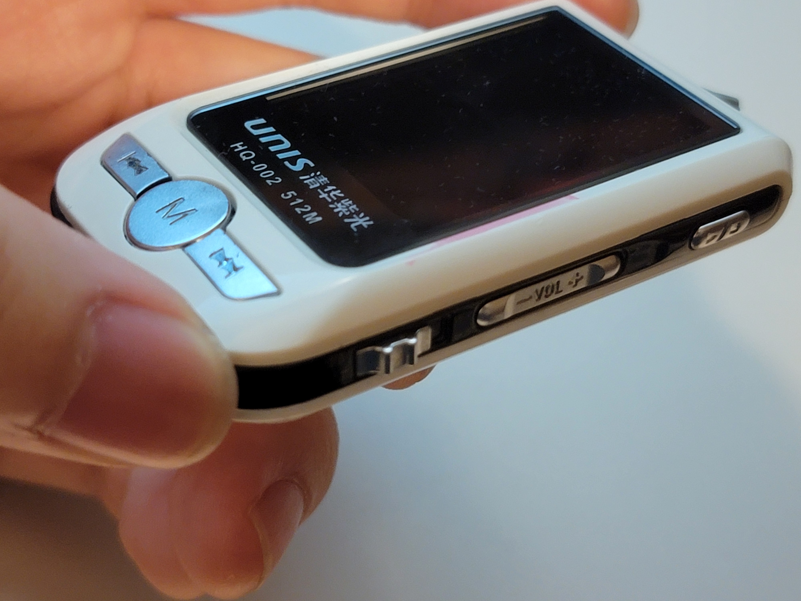
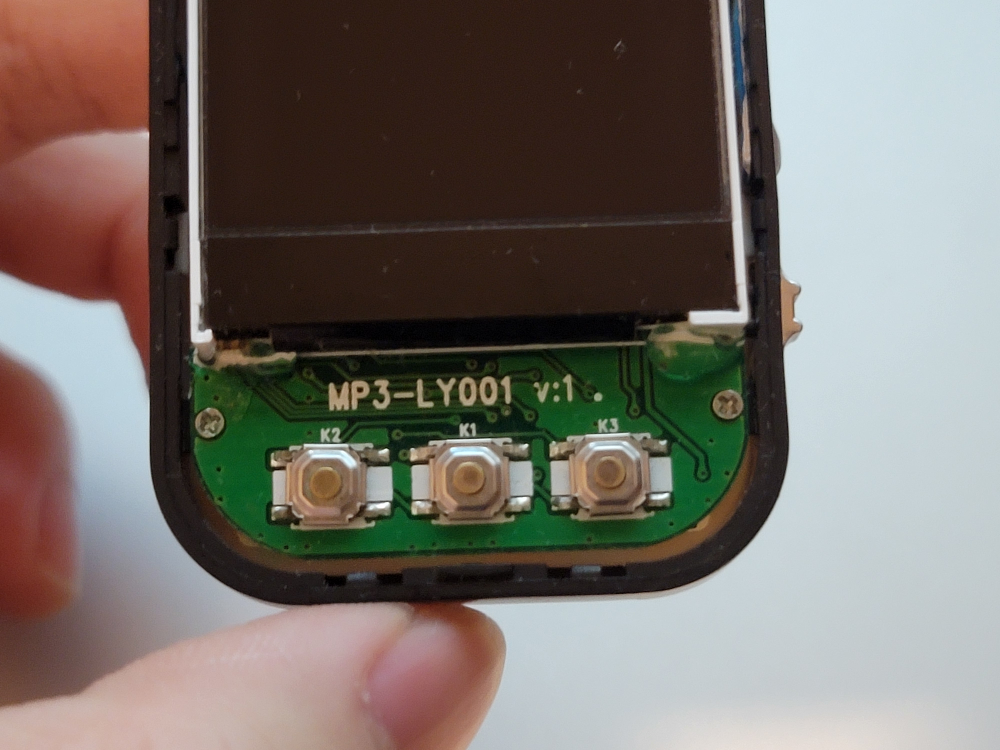
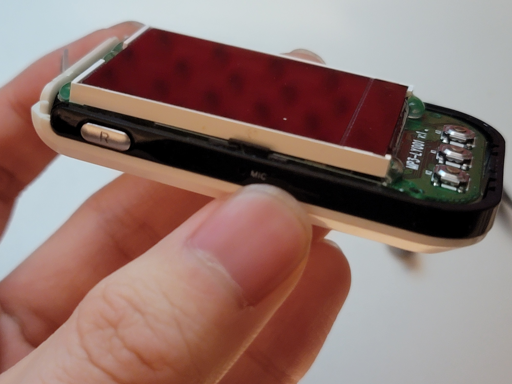
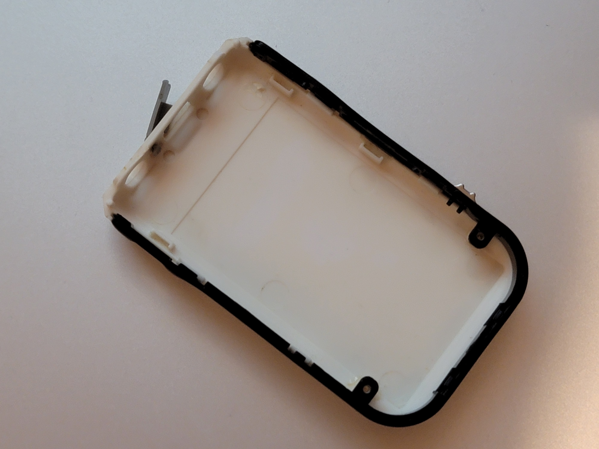
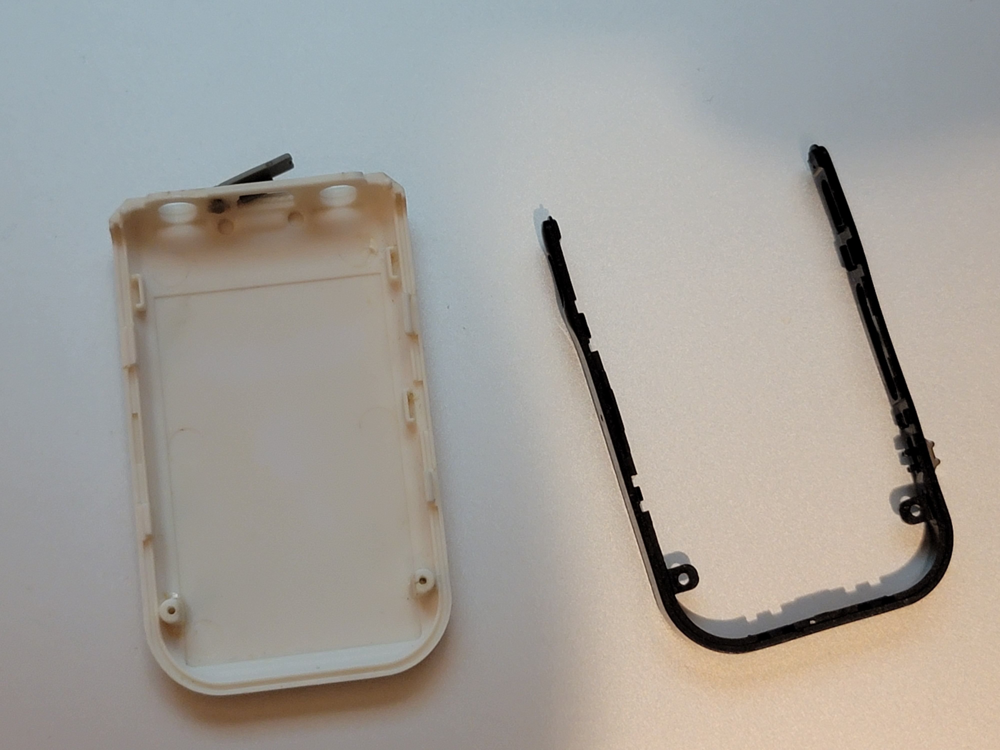
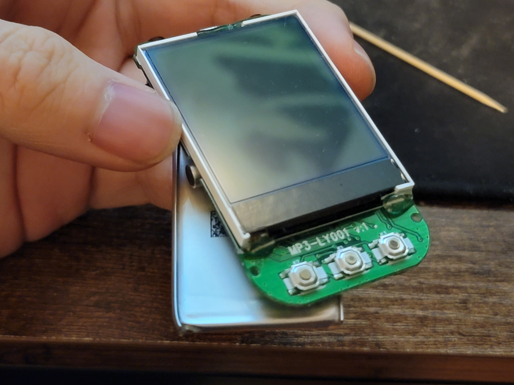
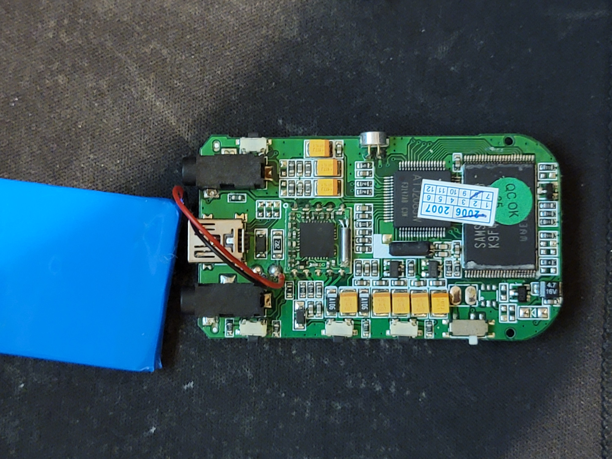
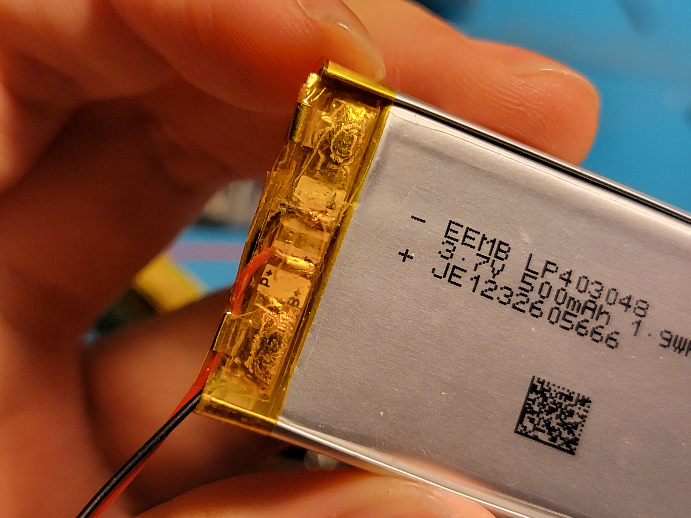
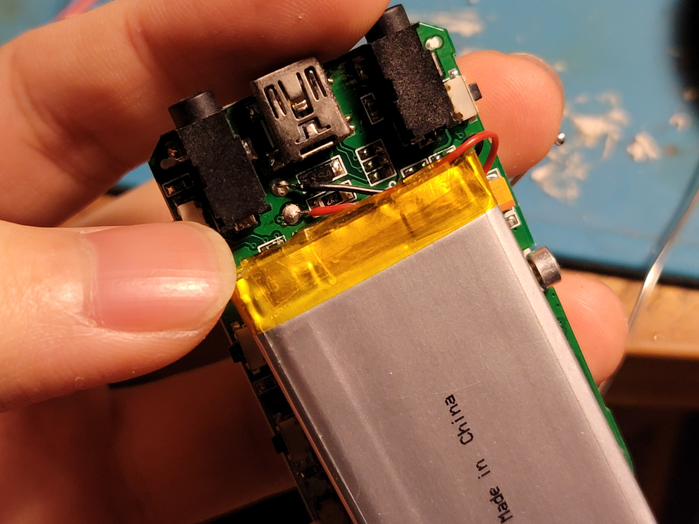
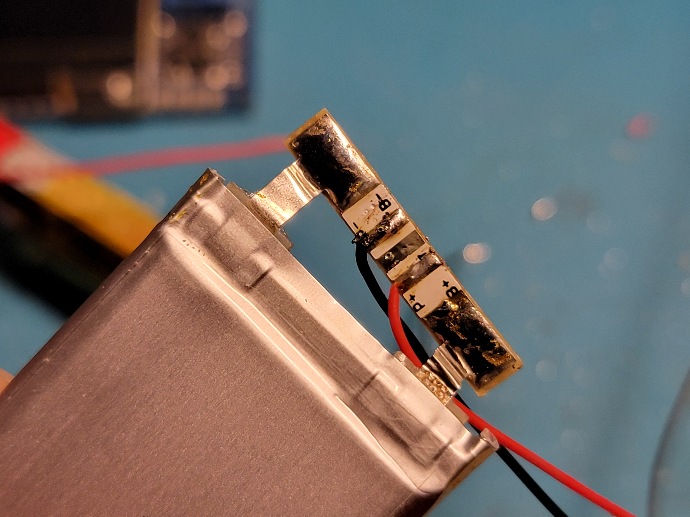

# MP3 Throwback!

Remember the good old mid 2000's, when flash memory was finally getting cheap enough that everyone could suddenly afford to carry around gigabytes of data on their own person (without DVD binders)? When the possibilities for portable electronics seemed endless and Moore's Law showed no signs of ceding its grip on reality?

Such was the age that this extravagant yet cheap enough to be mass-market MP3 player, the UNIS HQ-002 hailed from. Except I can find almost no details of this device on the internet, and it ships with the default language option of Chinese. So, who really knows?

Whatever the case, after so many years this machine was in a pretty unusable state, yet with a proper USB-miniB connector and audio quality befitting that of a time when everyone was used to CD-quality EVERYWHERE - none of that internet streaming 128kbps trash, are you kidding me, physical media all the way!! - it certainly has some good bones to salvage.

## Disassembly


- Observe (from left to right, on the edge) power switch, volume rocker, and play/pause switch. The front holds skip and menu buttons


- The front bezel and cover pop off of the midsection. DO NOT SEPARATE THE MIDSECTION FROM THE REAR COVER, they are screwed together and doing so will rip out the delicate screw posts, guess how I figured that out.


- On the left edge is the record button and microphone hole. Carefully unscrew the main PCB, lifting it out from the midsection and rear cover.



- Now, the midsection can be popped off the rear cover.


- The display is held to the main PCB with long-decayed glue, consider replacing it with some new stuff. Don't make it too strong though, this is a delicate part


- The blue-shrink-wrapped-metal-case lithium cell is soldered to the main PCB through a protection board - remove it, as by now it will have lost over 90% of its capacity.




- The maximum size of cell that can fit into this casing is `403048`, or `40mm x 30mm x 4.8mm`. One of those will easily double the original's battery capacity thanks to modern advancements in charge efficiency. Solder it on, keeping a protection board in between.

## Assembly

Follow all steps in reverse. The one finicky part of this is keeping all the button caps in their places in the midsection while the main PCB was going in. Some tape that can be laterally pulled out later helps a lot.

## Software

To my surprise, this device has little documentation on the internet, so I might as well provide what I can. After much experimentation, this is what I figured out

### Main Menu:
 Scroll through the listed modes with the skip buttons and select with the menu button. At any point, hold the menu button to back out to here.
### `Movie`
 responsible (presumably) for playing video files. I can't figure out what kind though, all of mine are "unsupported format"s.
### `Music`
plays music files, at least `.mp3` is supported while `.ogg` is not. `idv3` information is very poorly supported, best to remove most of it. Several UI elements display:
```
+----------------+
|    R       ]]] | Repeat Behavior ; Battery Indicator
|  (o)           |
| 01/08  0:02:32 | Track Listing  ; Play position
|   folder       | directory name
|SONG NAME SONG N| Song name
| 320k    ROCK   | bitrate ; Equalizer mode
|                |
|  16 )))   05:02| Volume ; Song runtime
| > ------=------| Play/pause ; seek bar
+----------------+
```
hitting a skip button skips to the next or previous songs even outside of the current directory, while menu button brings up the following:
- Local folder: navigate to the song you want to play, then hit the play/pause button
- Delete: does what it says
- Repeat: sets the repeat behavior. After a song is finished...
  - Normal: stop
  - Repeat One: repeat this song
  - Folder: go on to the next song in this folder, unless this is the last one, then stop
  - Repeat Folder: go on the next song in this folder, unless this is the last one, then go to the first song in this folder
  - Repeat All: go on to the next song, unless this is the last one, then go to the first song
  - Random: go to a random song in the same directory
  - Intro: Play only the first 30 seconds of a song, then follow "Repeat All"
- Exit : does what it says

### `Radio`
plays FM radio from the global or "Japanese" FM bands. Relies on headphone cables as antennae. The skip buttons move by `0.1MHz`, while play/pause skips to the next saved channel. The UI displays:
```
+----------------+
|    CH01    ]]] | Saved Channel indicator ; Battery Indicator
|    /           |
|  [--]  CHANNEL | Radio icon
|87           108|
|------------=---| frequency seeker
| 103.5MHz       | current frequency
|                |
| STEREO 16 )))  | mono/stereo indicator ; Volume
+----------------+
```
The menu button brings up the following:
- Save: save the current tuning as a channel
- Delete: does what it says
- Delete All: delete all the channels
- Normal Band: moves to the "global" `87-108MHz` band.
- Japan Band: moves to the "Japanese" `76-90MHz` band. I hear a lot of French radio on this side of the globe instead.
- Fine REC: start recording, moving to `Record` at a high fidelity
- Long REC: same, but lower fidelity for more runtime.
### `Record`
(to be completed, but this is pretty simple. Play/pause recording, auto-saving if you exit to main menu. No control over the file name, it just counts up from what is already in the voice recording directory)
### `Voice`
(to be completed, this one specifically plays back voice recordings from the voice recording directory instead of music)
### `Photo`
supports showing off `.jpg` images on its glorious `160x128` pixel display. Loads slowly. Press the menu button to enter directory navigation, then play/pause to open an image.
### `E-Book`
supports opening `.txt` files, in monospaced yellow font with no apparent line breaks. Navigate and open in the same way as `Photo`.
### `Setup`
- Clock: set the time to anything as long as it is between the years `2000` and `2010`.
- LCD Set:
  - Brightness: what it says
  - Darkle: confusingly, selecting this and the required number slider afterwards actually sets the seconds before inactivity dims the screen.
  - Black: the same, but inactivity will blank the screen instead
  - ScrSav set: the same, but inactivity will pop a screensaver instead.
- Language: pick between Simp. Chinese, Enclish, Trad. Chinese, Japanese, Korean, French, German, Italian, Dutch, Portuguese, Spanish, Swedish, Czech, Danish, Polish, Russian, and Thai. Most of those seem well supported, so this is quite a polyglot of a device!
- Power off:
  - Off time: the same as the LCD ones, but selecting this will actually stop playback and put the device to power off after some set number of minutes with no playback
  - Sleep time: the same, but the device will be put to a quick-wake sleep state instead
- Replay mode: I have no idea
  - Auto Replay
  - Manual Replay
- Online mode: I have no idea, this doesn't have a connection to the internet or any encryption on board.
  - Multi Drive
  - Normal Only
  - Encrypted Only
- Memory Info: see how much of the `475MB` usable storage is consumed by media
- Firmware ver: Mine prints `2005/03/15  3.5.37  2006/03/22  ACTS16D_16_SZG`
- Firmware upg: starts waiting for... something on the USB connection. No idea if the supporting software exists anymore.
### `Game`
- Boxman: sokoban! As the green dot, use skip for left/right and volume for up/down to push the blue boxes onto the red markers. No pushing 2 boxes at once, or pulling. Menu resets the level.
  - Game Start: does what it says.
  - Set MAP: select 1 out of 40 initial levels.
- Russia Block: tetris! Skip buttons move left/right, play/pause rotates clockwise. Only volume up performs a soft drop, and Menu quits the game. No hold boxes.
  - Game Start: does what it says.
  - Set Speed: start at 1 out of 5 speed levels.