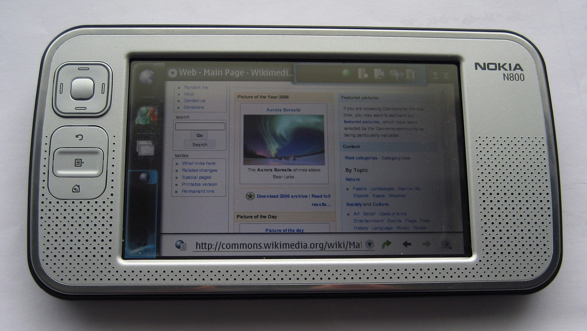
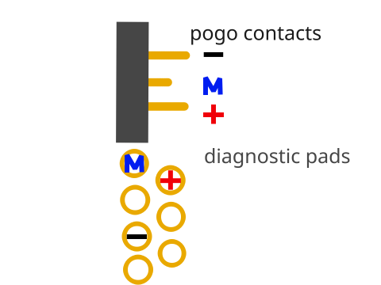
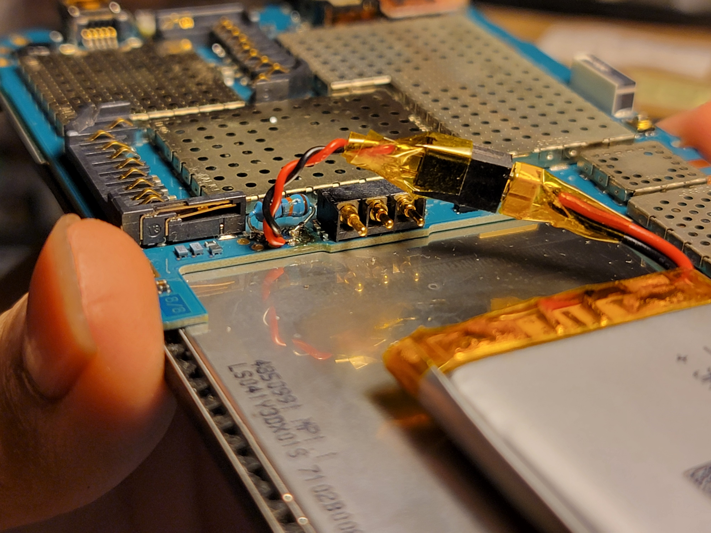
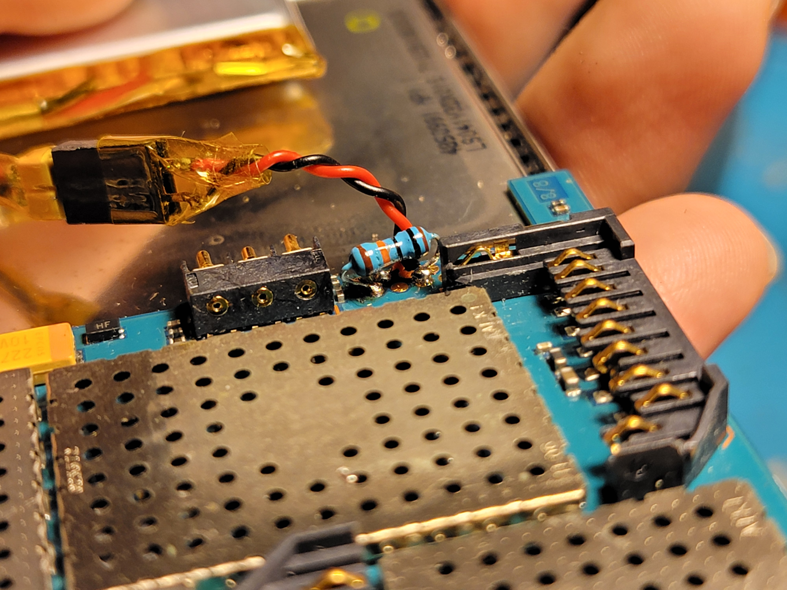
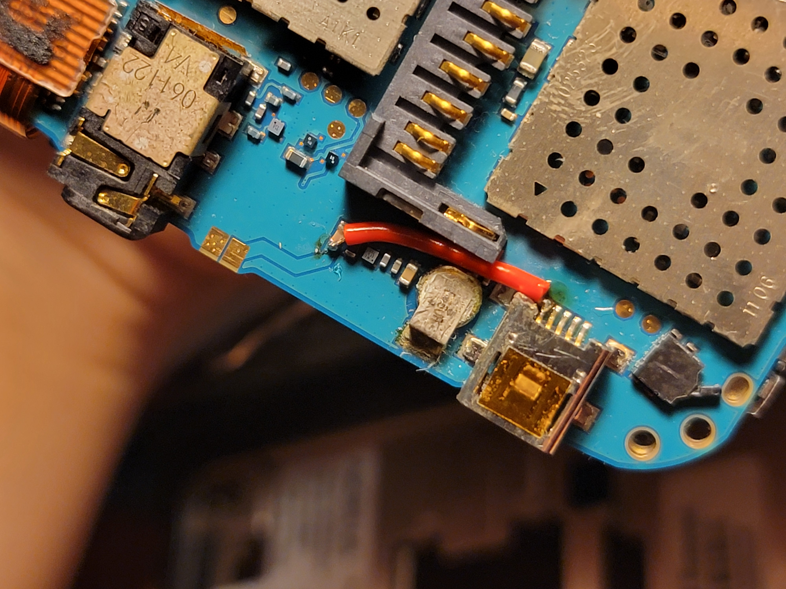

# Fixing the Nokia N800

What a blast from the past! The Nokia N line of "internet tablets" released around 2007 or so (who's counting?) to become one of the internet-connected devices of all time. With a Linux-based OS named [Maemo](https://maemo.org) that still enjoys an active community to this day, this tablet was and still is a useful extensible platform for any activity that benefits from a stylus-tablet form factor.

That being said, I would bet that most surviving N800s are in pretty rough shape - no lithium-ion battery can easily survive 15 years of even shelf life, and nothing can be guaranteed about any wearable flash inside the device. But we see the potential in such a device! Being the paragon of extracting maximum value out of every piece of technology, we here at LowTierTech will restore this tablet to its former glory - at least somewhat.

## Disassembly

Mercifully, this device hails from an age before everything was glued together. Thus, T4 and T6 screwdrivers are all one really needs, along with [this](assets/n800.pdf) totally legitimately obtained manual from [ManualsLib](https://www.manualslib.com/manual/1145225/Nokia-N800.html). Mind the display flex connectors!

## Battery

The official battery that shipped with the device is the Nokia BP-5L. While an exact replacement would be ideal, Nokia does not seem to still manufacture these new, and lithium-ion cells are products that do not get better with age. Some shady second-source manufacturers from China seem to offer these, but frankly it's not worth the trouble to ship them over if you already have lithium-ion cells lying around. Aything `1Ah` or more compares favorably with the original `1.5Ah`, keeping in mind the technological improvements in cycle life that 15 years brings.

The dimensional constraints of the internal battery box are `6*44*65mm`, but the spring-loaded pogo contacts will cut into the `65mm` figure a bit (unless you remove them).

After that comes the issue of connecting the cell to the device. Using the original pogo contacts is an option if you can fabricate a frame for the cell that has the same contact pads as the BP-5L. If not, there is a convenient set of 7 diagnostic pads near the battery contacts that are directly connected and will admit a small connector and some thin wires.

After hooking up the new battery, the device initially booted, then disappointingly immediately shut off. However, connecting the original BP-5L in parallel onto the pogo pins (only safe since it has so little capacity it doesn't appreciably charge or discharge the new cell) fixed this issue! So something is up with the third `M` pin.

I detected a `120kΩ` resistance between the BP-5L's `-` and `M` pins. It did not appear to change with temperature, so probably it is meant as a signature to identify a real Nokia cell (like Apple either used to do or still does in their USB cables). In any case, ooking up a `100kΩ` resistor between the corresponding diagnostic pads cleared this issue right up.

## Charging

While the N800 narrowly missed the age of glue, it unfortunately did launch right in the age of proprietary charging connectors.

However, we are saved by the presence of a USB connector, although it is mini-B. No matter, since the charging adapter states an output of `5V 350mA`, any USB will do just fine.

The modification here is straightforward, simply connecting USB `V+` to the charging connector's `V+`.

Do note that this might affect communication with the official software updater tool that instructs you to connect USB while also disconnecting the charge cable, but how many times are you going to need to update the OS on this thing?

## Pimping your N800

With all the hardware changes complete, all that is left is software. I recommend the guide on [maemo.org](https://talk.maemo.org/showthread.php?t=94294), although the accompanying point-and-shoot-camera videos are pretty garbage. It's understandable, I suppose, these were the late 2000s.

Late 2000s... and this year is 2024... aw heck - it's already been 15 years?! Who is still going to use this device anyway?