# Holography with Lasers!

or, how I learned to see 3D in 2D.

## What?

I first learned about true holography from the representative [wikpedia page](https://en.wikipedia.org/wiki/Holography) (Wikipedia of course being a veritable fount of surface-level knowledge - really, just check out the article of the day! I'm sure it's interesting). Sure, I had seen bold claims of holographic displays made of cheap clear plastic, holographic trading cards, holographic wrapping paper... none of them were interesting at all once you learned the tricks behind them, mere illusions, projections, or in most cases just plain sparkliness masquerading as 3-dimensionality.

But this new kind of holography promised actual complicated math, with wave interference and... well, that is mostly it, and the math's not all that complicated either. The wikipedia article offers a more complete analysis of the now 60-year old technique, but suffice it to say: shine a perfect laser beam at both an object (the object beam) and also straight at a photographic plate (the reference beam), so that object beam reflecting off of the object hits the plate too. Then you have the simple interference:

$${b_{reference} \oplus b_{object} = p_{recorded}}$$

To retrieve your hologram's contents, apply basic algebra by supplying a new reference beam:

$${b_{reference} \oplus p_{recorded} = b_{object}}$$

Simple as that, the object beam produced will be exactly that which the plate originally "saw" from the object when it was recorded upon. To your eyes, and any observer, an ideal hologram playback would be indistinguishable from the object.

## How?

Ok, enough theory. How do we produce a "perfect" enough laser beam? In this case, perfect means long coherence-length, or narrow bandwidth. Otherwise, how can you expect the beam to interfere with itself after reflecting off of the object? We need a laser that outputs an incredibly small portion of the electromagnetic spectrum, something on the order of `10fm` to get a coherence length in the single-digit meters. Not easy!

This requires a Single Longitudinal Mode laser, which is not that easy to suss out without some serious equipment - but this is LowTierTech, and serious equipment is my allergen. Most laser diodes are either low power (good luck exposing anything) or Multiple Longitudinal Mode (again, good luck recording anything), and most other sorts of lasers are honestly a bit too much trouble to make it all worth it. Luckily, [W](http://hololaser.kwaoo.me/), a great holographer and engineer, has already done a lot of work for us here in identifying suitable lasers. In particular is the [OSRAM PL530](http://hololaser.kwaoo.me/laser/PL530.html), a solid-state device that can generate `100mW` `530nm` SLM beams, which is perfectly suited to our task. Note that W also presents a wonderful driver system for the PL530, but it is too complicated for the basic holography I want from it. 

## Driving the PL530

It is very important that you read up on the peculiariaties of the OSRAM PL530 in the link above, so please do so before continuing! It is no ordinary laser diode!

Additionally, the usual warnings for solid-state laser fragility apply here as well. I blew up no less than 4 PL530's developing this working holography laser, and if you embark on this project expect to do the same.

Here is the electronic engineering portion of this post. From W's amazingly informative analysis, the important parameters of driving this device are, in rough priority order:
- Constant laser current, around `450mA`
- Constant temperature, around `14°C` to `18°C`
- Constant heater resistance, but this will depend on the above parameters

With temperature control a priority, and less than room temperature at that, a TEC and large heatsink are required.  On top of that, a CC driver for the laser is needed, but since CR drivers for the heater are also a little annoying to create, we can cheat here - if all the other parameters are set, then driving the heater with CR is equivalent to driving it with CV at around `2.2V` to `2.4V`, just at the voltage that would have resulted in that resistance anyway. It is also lot safer than using CC, with this resistor being a PTC device. Add on some power supply systems, and... time to build!

## Implementation

This article is more of a story than a walkthrough, so no board-level assembly instructions are provided. Form factors and board designs will be highly dependent on the physical specifications available to you anyway, and none of the schematics are that complicated anyways, all of them being single feedback drivers.

### Thermal Construction

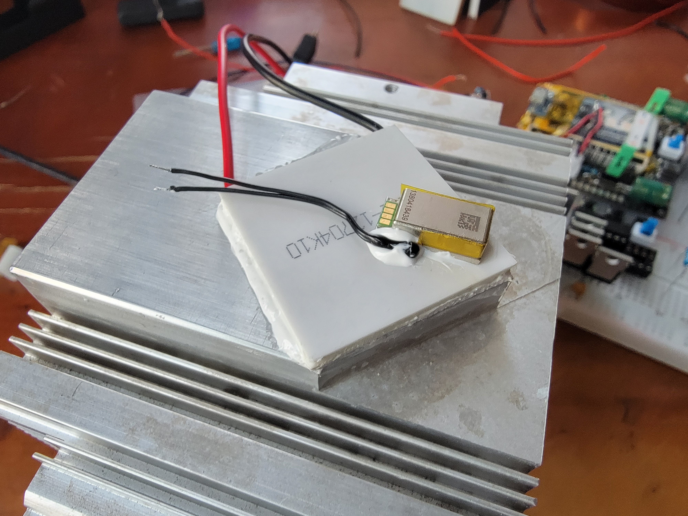
I acquired a huge heatsink from an old PC which perfectly fit a `40x40mm` TEC on top of it. The larger your heatsink is (within reason) the better, as you cannot use fans to move air and help to cool. Any moving air at all creates vibrations which can jiggle the object or plate around, ruining the hologram recording process entirely. So in this case, size matters!

Use some thermal glue to secure the PL530-TEC-heatsink stack, and also a thermistor to provide temperature monitoring and control. The tape on the PL530 is to protect its uncleanable output window.

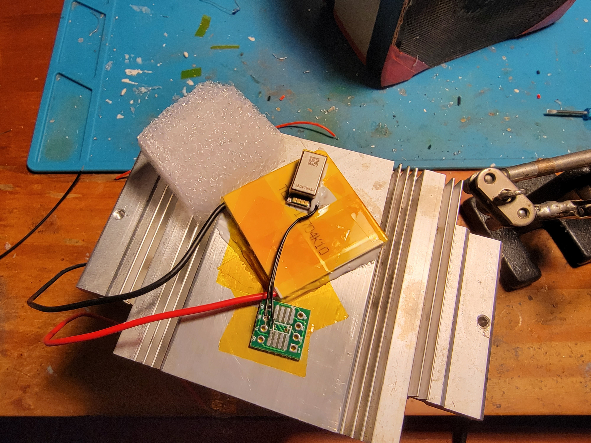

Next was insulation of the cold zone - no reason to make the TEC work harder than it has to. Kapton provides a basic protection, but cutting out and molding in a styrofoam cap will really help to cut down thermal transfer with the outside air.

Additionally, the tiny pads on the PL530 itself and the NTC thermistor are difficult to solder to and work with, so I glued down a miniature breakout board.

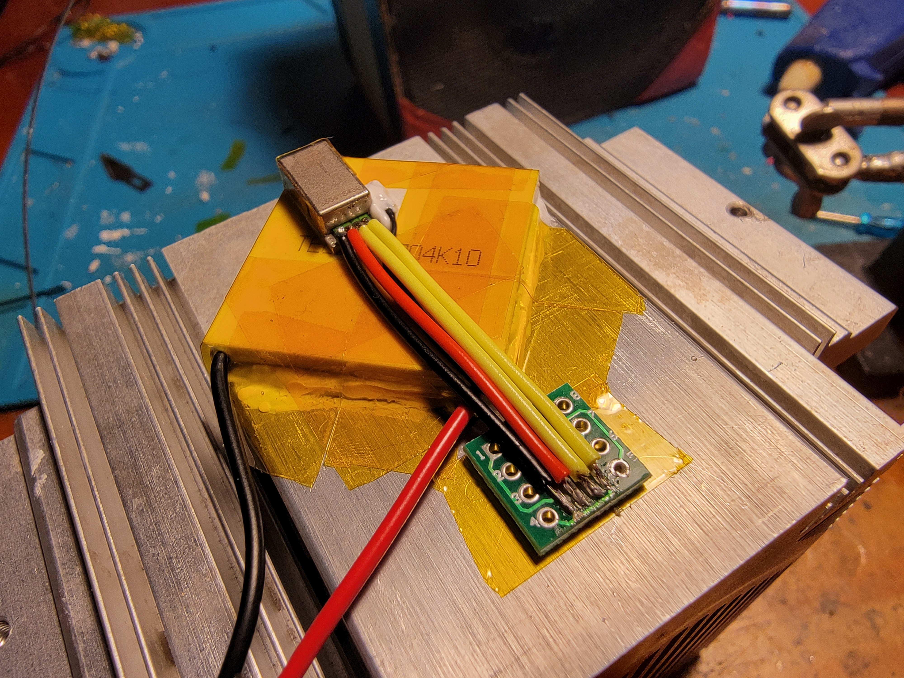
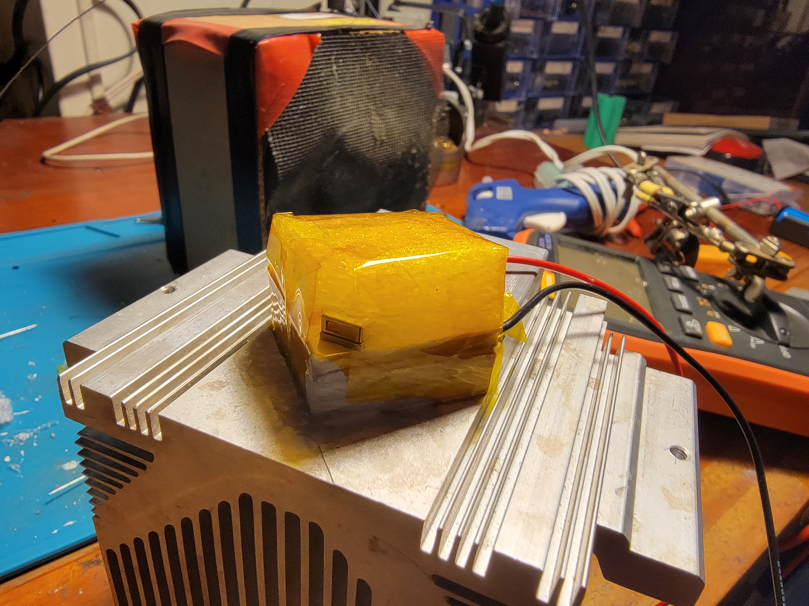

Attaching the 6 wires - 2 from the thermistor, 4 from the PL530 - to the breakout board is next. At this point I sealed the styrofoam cap onto the cold zone.

### TEC Control

I decided against linear regulator of the TEC voltage - the amount of power it would need would roast even low-dropout regulators, and 100kHz noise really isn't that much of a concern when the TEC is strapped to a kilogram of metal. Good luck changing the temperature of that thing up at all in 10 microseconds. This means I can use dirt cheap LM2596-based switching buck converters with a little modification:

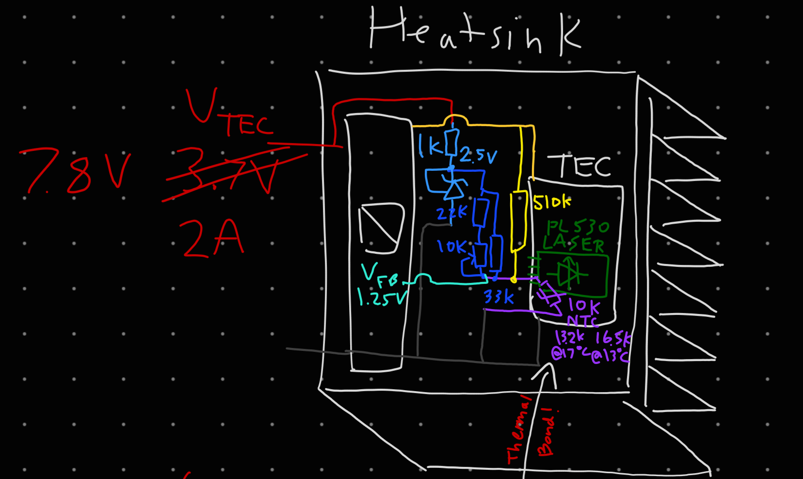
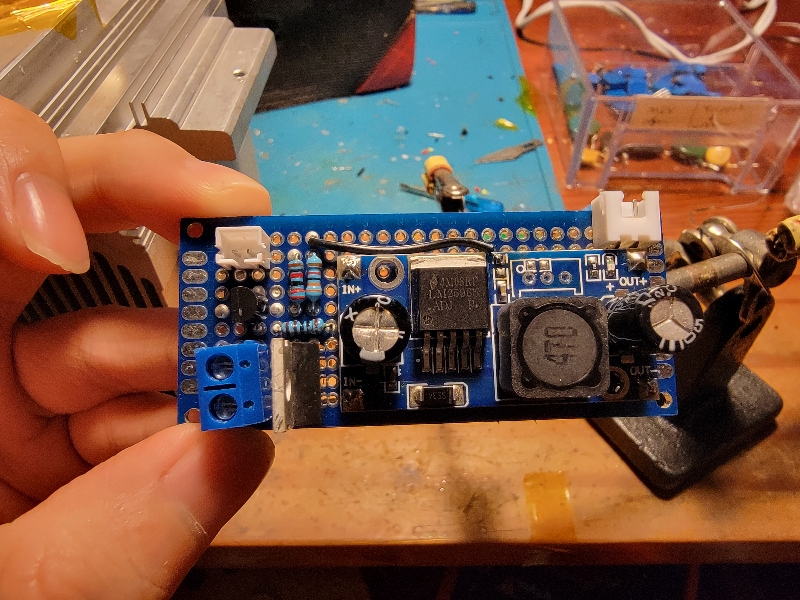

The feedback voltage of the LM2596 (remember, this thing will output as high of a voltage as necessary to get its feedback pin to `1.25V`) is derived from a simple voltage divider consisting of a variable resistance for later fine-tuning (in $\color{blue}{dark blue}$) and the NTC thermistor (in $\color{purple}{purple}$) between a `2.5V` reference from a TL431 (in $\color{cyan}{light blue}$) and ground. But with my poor knowledge of control systems, this didn't consistently result in a stable drive voltage and so temperature. No matter, forcing even more negative feedback with a very large but still significant resistor (in $\color{yellow}{yellow}$) between the output and feedback led to wonderful stability!

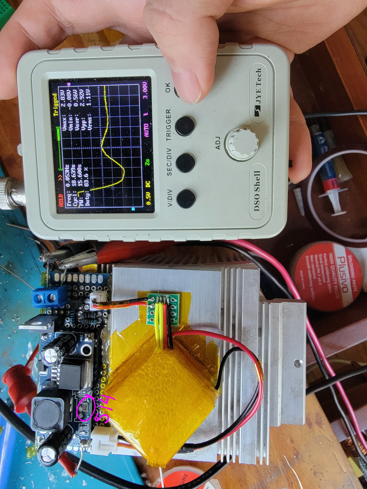

After gluing this board to the construction and wiring it up to the TEC output and NTC thermistor input, all was well, and the cold zone could be cooled to a tightly controlled adjustable temperature.

### Laser Drive

For the laser itself, switching converters are a total non-starter. We really do need double-digit microamp control. So it was back to linear regulators, except I decided on the ring-of-2 single MOSFET driver instead because I ran out of linear regulators. Oops.

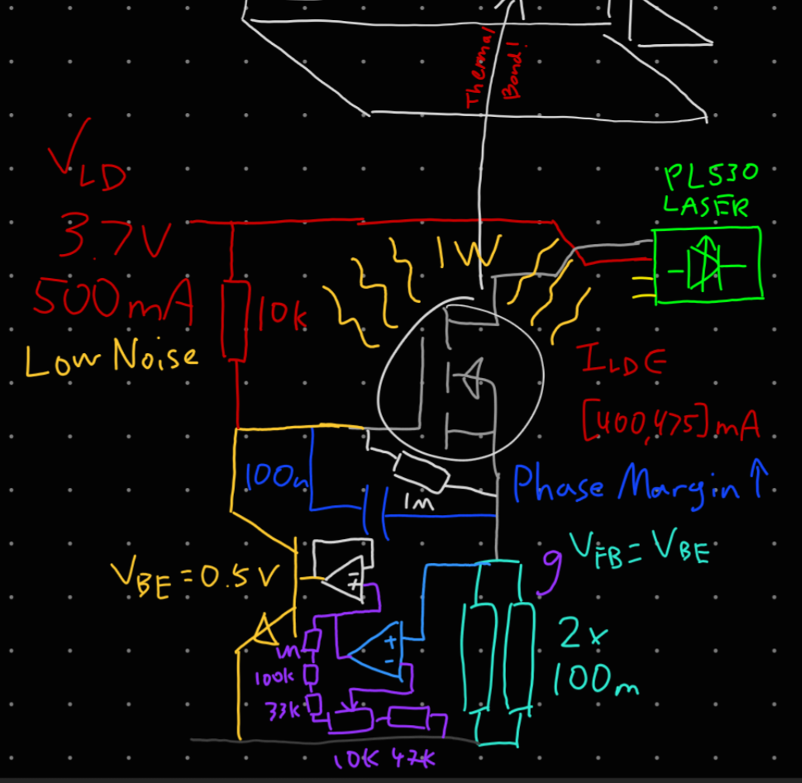
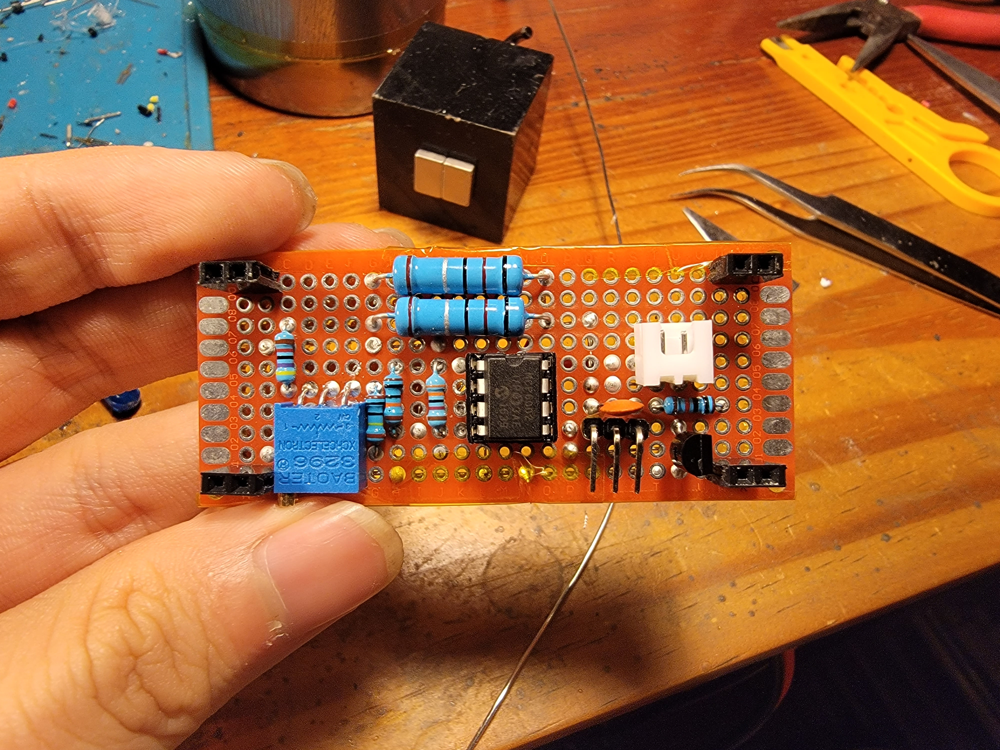

An additional consideration is that linear regulators of all sorts will heat up significantly, and that would throw off many parameters of the laser driver. If only there was a huge heatsink nearby to dump all that heat into. So, I decided to locate the current limiting MOSFET not on the board itself, but instead bolted to the huge heatsink nearby, with jumper leads to connect it to the rest of the circuit.

The feedback mechanism on this one is just as simple. The overall principle of the ring-of-2 is that a PNP (in $\color{orange}{orange}$) pulls down the gate voltage of the NFET (in \color{gray}{gray}), with its own base connected to a shunt (in $\color{turquoise}{turquoise}$) that the NFET chokes. So, in principle, ${0.6V = I_{set} V_{BE}}$. However, we want some adjustability! By adding a dual operational amplifier, one half for amplifying the feedback voltage by an adjustable amount (in $\color{purple}{purple}$) and the other half for buffering that amplified voltage to send through the PNP's base, we get a tightly controlled adjustable current limiter for the laser.

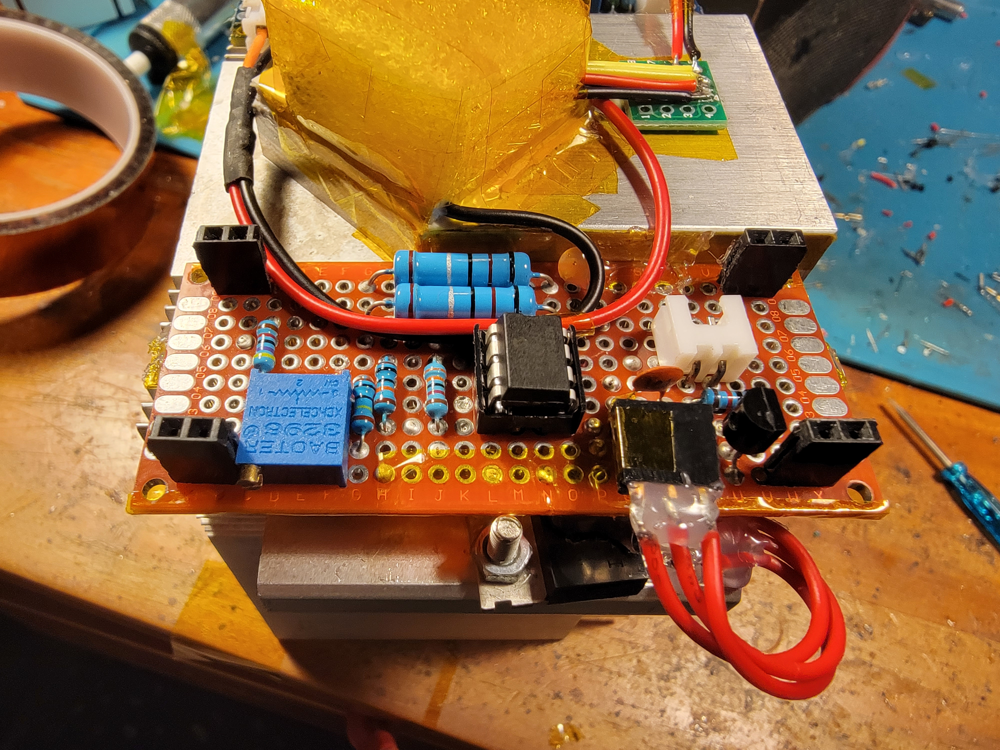

Gluing this board to the construction and wiring it up to the LD output, we have a stable laser current. But the light it outputs right now is pitiful, because we still haven't set up...

### Heater Drive

As before, there is no need to drive the heater with CR after the other constant drivers ensure the other parameters of the system are also constant (enough). So, an extremely simple CV drive powered by a linear regular (of which at this point I had purchased more of) will suffice.

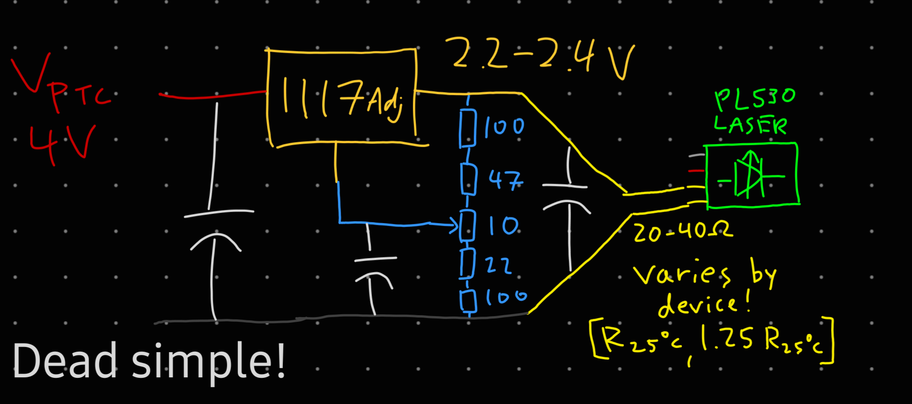
Thanks, past me for the comment.

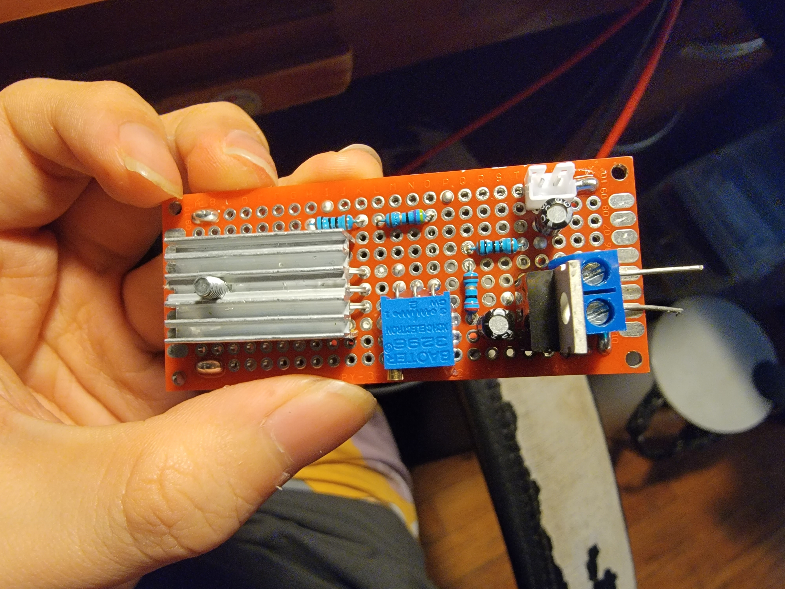

This is a classic LM1117 adjustable voltage regulator, not much to say. A voltage divider (in $\color{cyan}{light blue}) provides the feedback voltage to the linear regulator. Do note that the linear regulator still needs a heatsink, but this driver passes much less power than the laser driver, so a small one is fine.

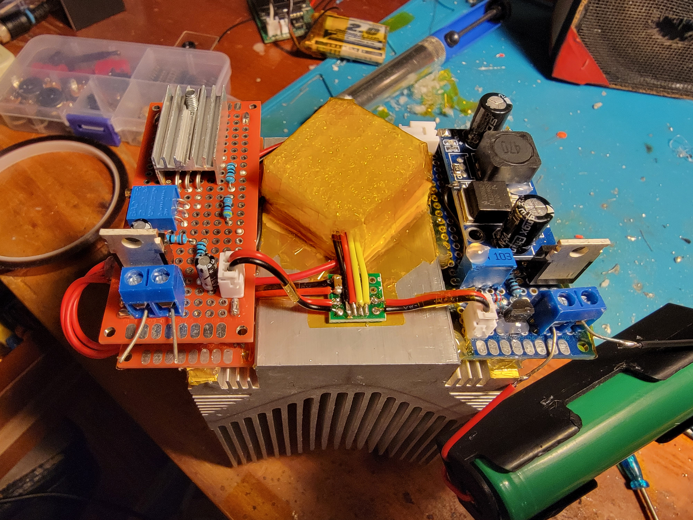

Stacking this board on top of the LD driver (space efficient, eh?), wiring it to the heater output, powering everything up, and... could it be?

### Results

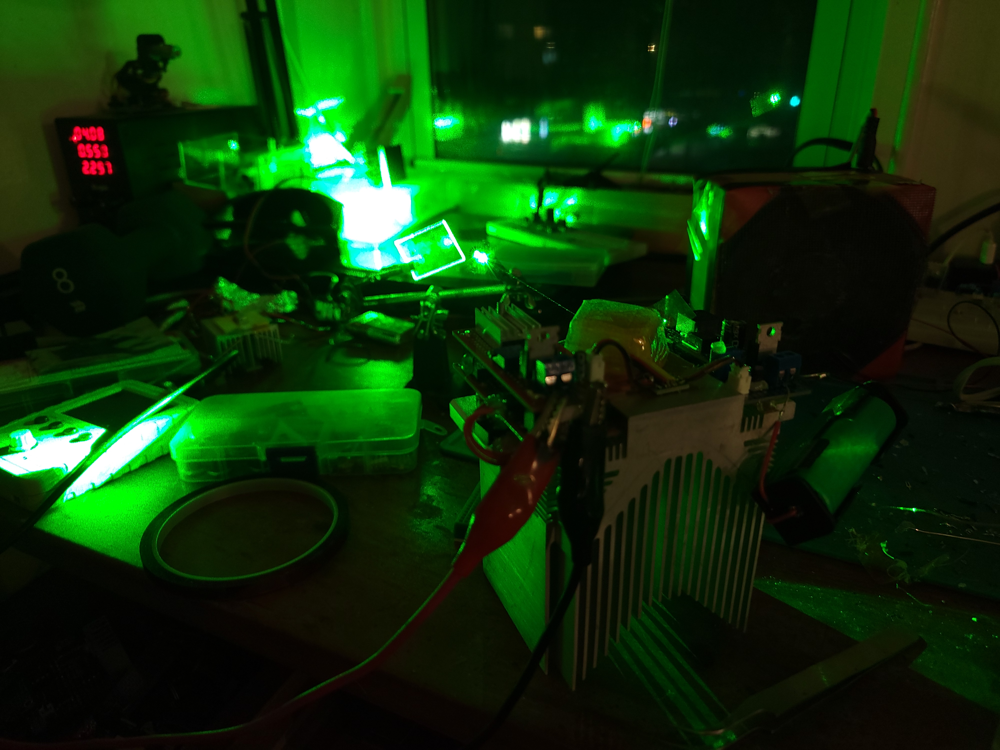

The beam of this laser is truly brilliant - it has minute divergence, ideal gaussian circularity, and hopefully it is of extremely narrow bandwidth too. But how can we test the longitudinal modality of this laser without sophisticated equipment? (this is LowTierTech!)

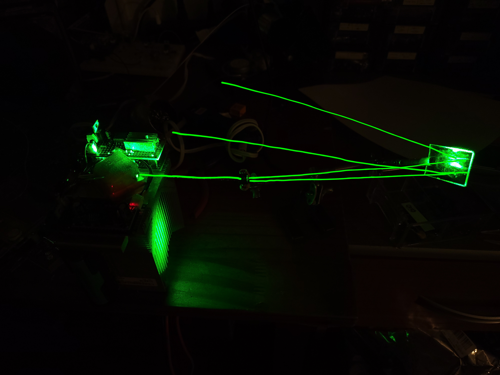

A single-etalon interferometer, or in simple terms, a microscope slide, will do just fine. Spread out the thin beam with a lens, reflect it off the microscope slide, and the beams reflecting off the front and back side of the slide should have just about equal intensity while having a well-defined phase delay. Since anything reflecting more than 1 time is too weak to matter, these 2 beams can interfere without outside interference to create a classic fringe pattern:

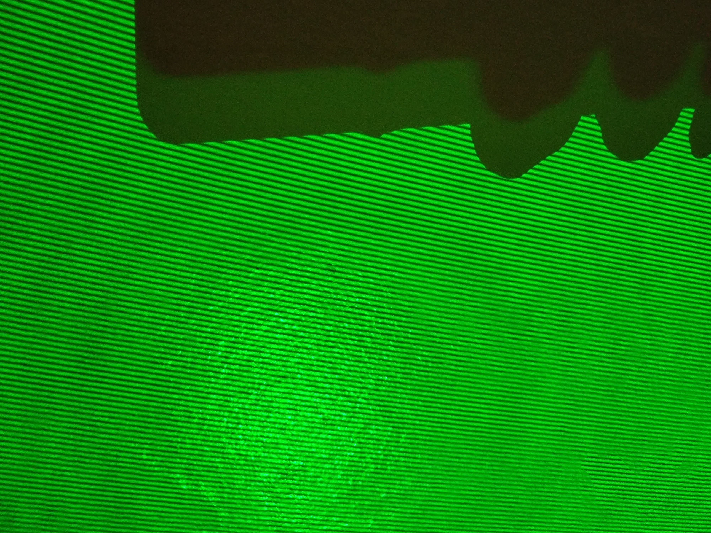

### Eye Candy!

The actual process of hologram shooting does of course involve a little more beyond the laser itself, but I know none of you would be satisfied reading this far without some of that holography goodness. So here are some exemplars. Of course, these won't look 3D at all to you if you are viewing these clips on an ordinary non-holographic display (or one of those fake holographic displays), but I hope the camera movement gives you some sense of what your eyes would see. (MP4s around 30MB each)

[`The Protagonists of Murksanctuary: Maxillae of the Tiger`](assets/holograms/gloomhaven.mp4)

[`Lungmen Guard on Holiday`](assets/holograms/chen.mp4)

[`Robot Mom who Really Hates Angels`](assets/holograms/unit1.mp4) 
