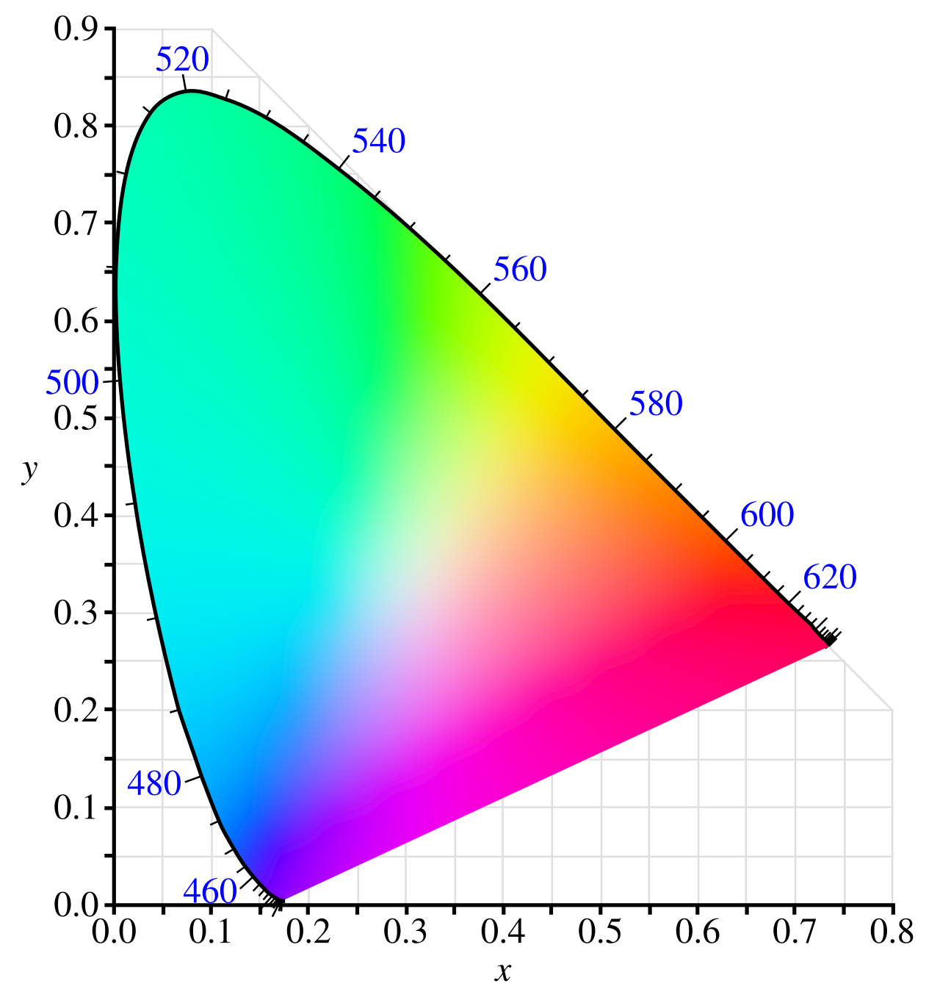
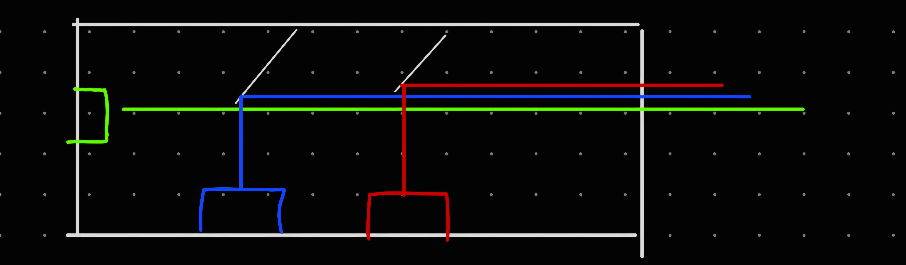
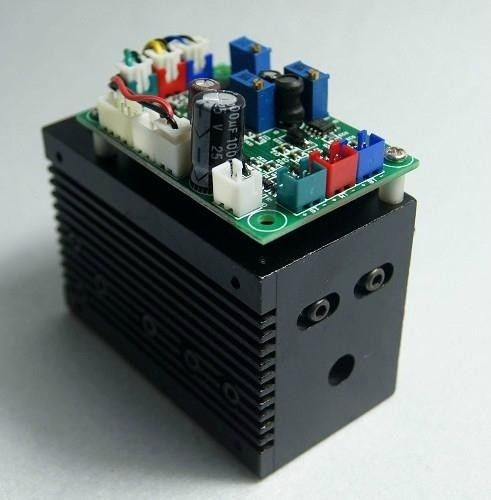
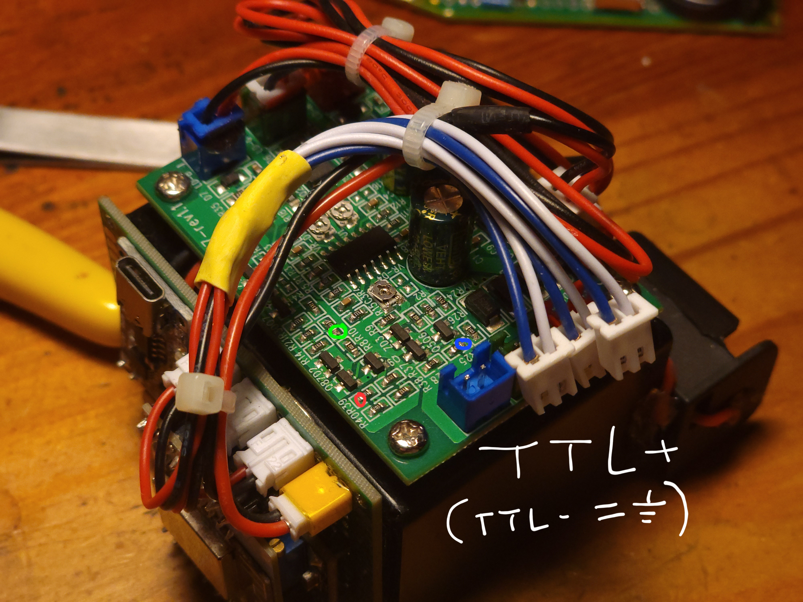
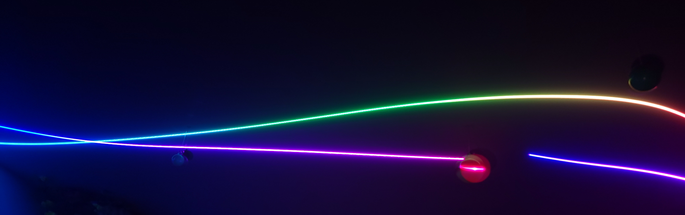

# I See Rainbows

In a perfect world, lasers would be easy and cheap to generate for any wavelength on the electromagnetic spectrum, in brilliant power too. But this world is cruel, and so diode and gas and dye lasers (other types being a little too exotic for the average hobbyist) are limited to narrow bands of the spectrum.

No matter, those LCD display people figured this out years ago. By combining pure-ish red, green, and blue light, our eyes can be tricked into perceiving many many different ratios of long, medium, and short cone stimulation, and that gets interpreted as color!

The science behind this is fascinating, but also complicated (like almost all biology is). We can abstract a little bit and just consider the CIE color space, a standard that is agreed to somewhat well represent the span of human color perception:

The curved boundary on the top represents monochromatic stimulation, or the most pure a color can be. By varying the relative intensities of 2 monochromatic lights, any stimulation (perceived as color) on the line between them can be synthesized. Varying 3 allows anything within the triangle formed between them. And, given the primaries we are using are lasers (so negligibly close to monochrome for this application) at the typical `450nm`, `520nm`, `650nm`, this covers a vast portion of the color space and allows reproduction of a similarly huge array of colors to the human eye. (in fact, much more than `sRGB` or even fancy schmancy color spaces like `Rec2020`)

## Combining Beams

Doing this with lasers is not that bad. To achieve a single beam composed of three, we can use 1 of 2 techniques. The first is knife-edging -- think a beam reflected by the very edge of a mirror so that it ends up shining right next to another beam. This works, but is pretty lame because you can never have all the beams occupy the same space.

The method of choice is then dielectric filtering. Dielectric mirrors use thin-film interference to achieve superb (>99.9999%) reflectance of certian wavelengths, and transmit others, like magic. This lets us stack beams right on top of each other, and is exactly what we want. And luckily, this being the industry choice for light manipulation, sets of blue-reflecting and red-reflecting dielectric mirrors are commercially available.

## The Module

You can of course do all of this alignment yourself to create an RGB laser module (and I have once went through the work of optical alignment and miniature breadboarding, it was quite enjoyable, article forthcoming!). But turns out, the modules themselves can be bought from your favorite direct-from-China marketplaces as well, saving quite a lot of labor. Why not?

(this one is just an example, the design will vary a bit)

The module I bought is controlled with 3 TTL inputs. However, these inputs are all are default-enabled, which is extremely unsafe. Imagine that the controller hangs and stops producing control signals, or it is just starting up, or even worse, the control lines are cut!

Therefore the first modification necessary will be to install safing resistors on all inputs to ground so that they become default-disabled. Experiment to check what resistances you need, `1kO` works for this specific module.

## The Controller

I decided to make this controller ESP8266-based both because I wanted to set up a hardward programmer and the software toolchain for it, and also because I had so many of them lying around. The circuit for it is really nothing special, so I won't be drafting the schematic. A battery + protection board feeds both the controller, a boost converter supplies the module's 9-12V power needs, and 3 control lines connect the controller to the module, that's all.

## The [Software](https://github.com/MrCocoNuat/rgb-controller-wifi)

The ESP8266 acts as a wireless access point. Upon connecting to it, it presents a simple static interface that allows a user to set solid colors or preprogrammed effects.

## Enhancements?

The most glaring flaw of the controller is the lack of gamma control - that is, doubling the value of Red, for example, does not create a laser output that is twice as red. This can be solved with a simple lookup table.

Additionally, there are always interface improvements to be made, and more preprogrammed effects to add (even allowing the user to save their own!). But for now, enjoy the rainbow!

