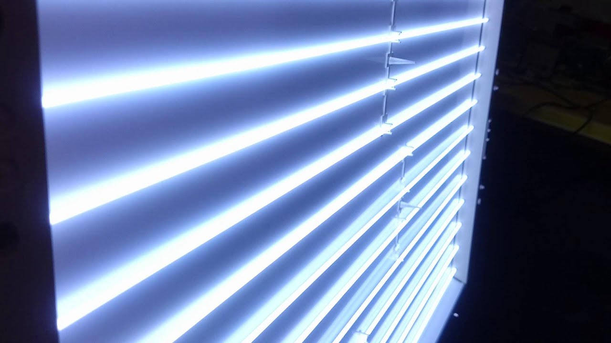
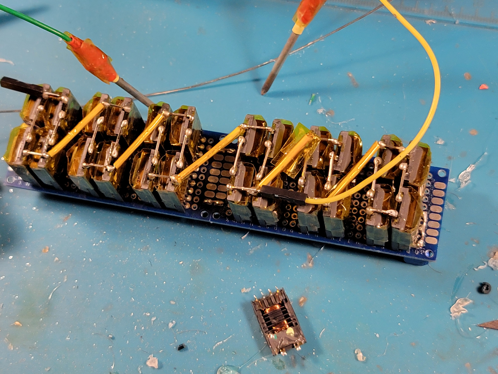
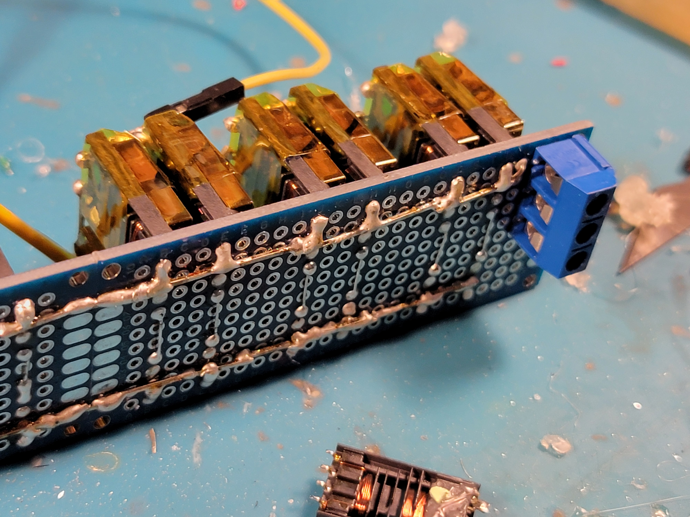

# Stupidly High Voltage Generator

****
**DISCLAIMER**

**This project involves high voltages (`>1kV`) at significant continuous power levels (`>100W`)**

**This high voltage can kill you in an INSTANT if you touch it wrong!**
****

Power transmission across the modern world is made possible by transformers. They take the output voltage of generation stations and push out kilovolt and even megavolt line voltages for maximum transmission efficiency (more voltage means less current losses!), then other transformers step that back down in stages to the `120/240V` of mains wiring.

Gee, that kilovolt talk sure sounds fun. How can we harness the power of transformers too? Armed with a ZVS driver, this is very easy.

## Harvesting transformers

While transformers are mechanically extremely simple devices (multiple loops of wire around some ceramic), their electrical properties are not so. At a base level, transformers have coil inductance/reactances and optimal frequencies for coupling that have to be respected, or else the transformer simply wastes all the input power as heat in the coil, core, or the air.

For a ZVS voltage of `60VAC` at `20kHz`, we certainly cannot use old iron mains transformers that are optimized for `60Hz`. However, nearly any modern switch mode transformer will perform at least acceptably - all that matters is their maximum power. Additionally, for the ability to select out of multiple output taps, some modularity would be best.

Therefore, the ideal way to get some transformers is out of **old CCFL displays** - there are generally many of these in each appliance, especially large TVs that hold over 20 CCFL tubes. And, they are practically perfectly specialized for the job of stepping up `20kHz` `30VAC` to around a kilovolt for driving said tubes. Plus, almost no one seriously wants these TVs anymore, and in fact along with plasma displays they are starting to disappear! So, get your transformers while you can!

## Assembly

... just hook up the input power to a couple of transformers, and make sure the output is well isolated from the circuit... do you really need a schematic for this?

Depending on your exact desired tapping mechanism, your connections will vary, but I decided to first group my many miniature transformers in `2S2P` blocks to increase the maximum power they can pass, then allow connecting up to 6 of them in parallel on the input side (so each block generates the full output voltage) and connecting those same 6 in series on the output side (for the maximum output voltage). Using 4 blocks out of 6 with my low-powered ZVS driver, this generated about `12kV` with continuous output at up to `120W`... scary! For illustrative purposes, this was able to arc across almost a centimeter of air when both electrodes were sharp (although the arc very quickly melted these points down), and sustain said arc over 6 centimeters. Once again, be warned that **this high voltage can kill you in an INSTANT if you touch it wrong!** So be careful!

There are certainly special safety considerations to be had with this output voltage. First, each individual transfomer's output side is shrouded with polyimide tape (individually they are only... `1000V`? polyimide is able to withstand that). Also, you cannot use protoboard anywhere near the output end - it is custom PCBS with cutouts, or simply no board at all, with similarly shrouded strands of wire connecting each block of transformers. Finally, I made sure to form corona balls on each output solder joint to minimize corona, or the thin wispy purple discharge of electrons from sharp accumulation points at high voltage. While they look pretty, they also leak away power and easily arc.

The electrodes themselves are... really not up to spec. In fact, I constantly feel a low tingling sensation when using them, but I am still alive, so who cares! They are simply wires soldered to steel nails, wrapped in plastic insulation and more polyimide tape, and here I was careful to trap many many air pockets in the tape to provide even more isolation.

